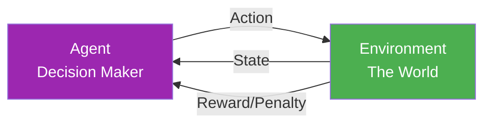
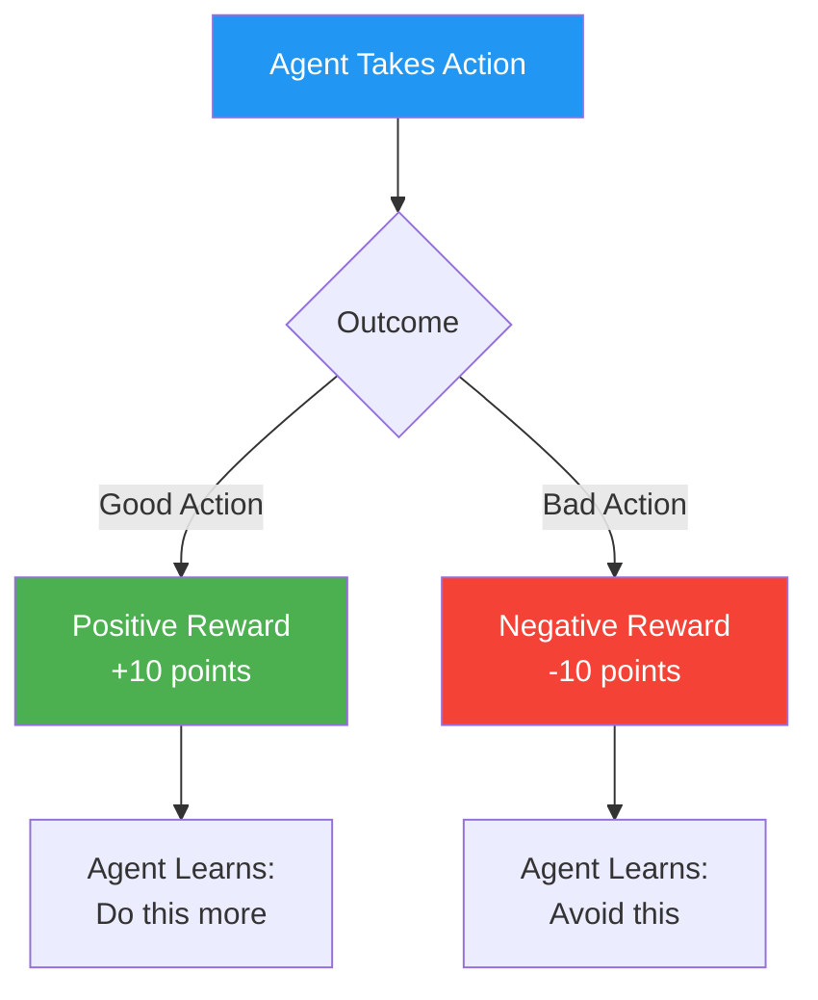
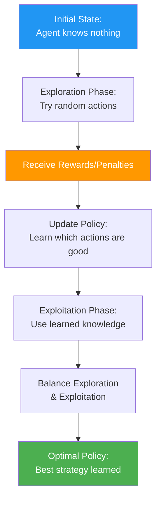
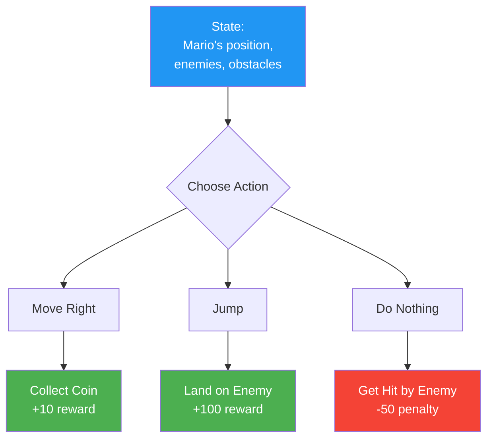
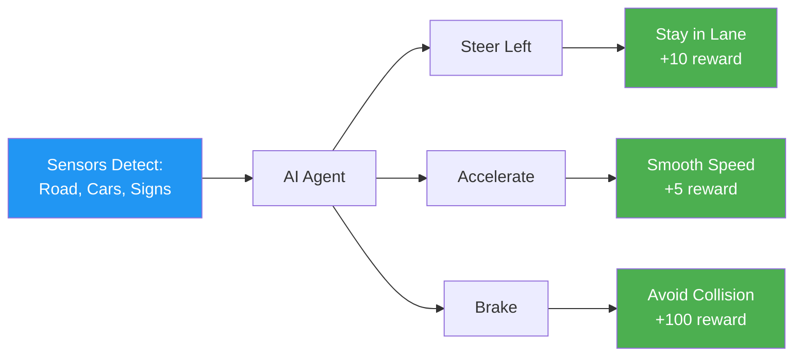
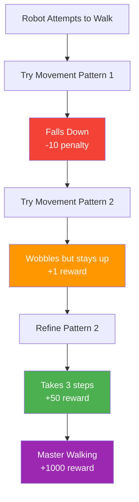
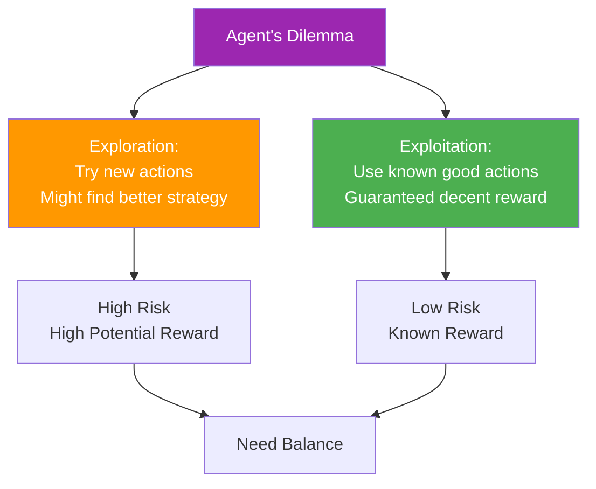
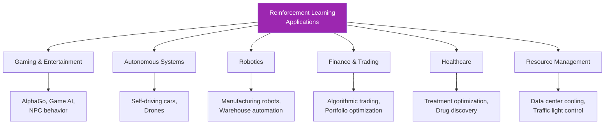
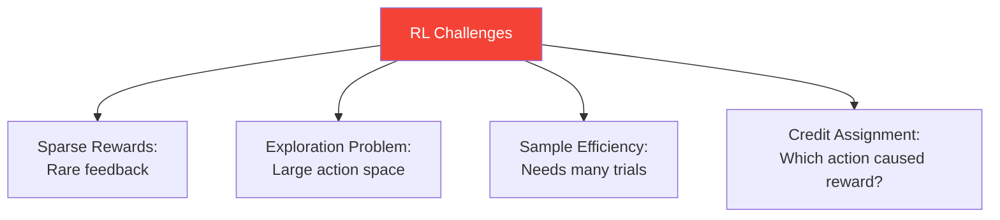

> *Like training a dog - reward good behavior (sit = treat), penalize bad behavior (bark = no treat).*

**Parent Note:** [[1. Types of Machine Learning]]

---

## What is Reinforcement Learning?

Reinforcement Learning (RL) is a learning paradigm where an **agent learns to make decisions** by interacting with an **environment**. The agent receives **rewards** for good actions and **penalties** for bad actions, learning to maximize cumulative reward over time.

**Analogy:** *Like learning to ride a bike - you try different actions (pedal, steer, balance), fall down (penalty), stay upright (reward), and gradually learn the optimal strategy through trial and error.*

### Key Difference from Other Learning Types

**No labeled data is provided.** Instead, the agent discovers which actions are good or bad through experience and feedback.

---

## Core Components

### The RL Loop

1. **Agent** observes the current **State**
2. **Agent** takes an **Action**
3. **Environment** transitions to a new **State**
4. **Environment** gives a **Reward** (or penalty)
5. **Agent** learns from the feedback
6. Repeat

---

## Key Concepts

### 1. Agent

**Definition:** The learner or decision-maker

**Analogy:** *The player in a video game*

**Examples:**
- Self-driving car
- Chess-playing AI
- Robot
- Trading algorithm

---

### 2. Environment

**Definition:** The world in which the agent operates

**Analogy:** *The game world with its rules and physics*

**Examples:**
- Road network (for self-driving car)
- Chess board (for chess AI)
- Physical space (for robot)
- Stock market (for trading algorithm)

---

### 3. State

**Definition:** The current situation or configuration of the environment

**Analogy:** *Your current position and surroundings in a video game*

**Examples:**
- Car's position, speed, nearby obstacles
- Current chess board configuration
- Robot's location and sensor readings
- Current stock prices and portfolio

---

### 4. Action

**Definition:** The choices available to the agent

**Analogy:** *The buttons you can press on a game controller*

**Examples:**
- Steer left/right, accelerate/brake
- Move chess piece
- Move forward/backward, turn
- Buy/sell/hold stocks

---

### 5. Reward

**Definition:** Feedback signal indicating how good an action was

**Analogy:** *Points scored or lost in a game*

**Examples:**
- +10 for staying in lane, -100 for collision
- +1 for winning chess game, -1 for losing
- +1 for reaching goal, -0.01 for each step
- +profit for good trade, -loss for bad trade

---

## How Reinforcement Learning Works

### The Learning Process

### Trial and Error Learning

1. **Random Exploration:** Agent tries different actions
2. **Feedback Collection:** Environment provides rewards/penalties
3. **Pattern Recognition:** Agent identifies which actions lead to rewards
4. **Strategy Refinement:** Agent improves decision-making
5. **Optimization:** Agent maximizes long-term reward

---

## Example 1: Training a Dog

**Analogy breakdown:**

| Component | Dog Training | RL Term |
|-----------|-------------|---------|
| **Agent** | The dog | Learner |
| **Environment** | Your home, yard | World |
| **State** | Dog's current position, what it sees | Observations |
| **Action** | Sit, stay, come, bark | Decisions |
| **Reward** | Treat, praise | Positive reward (+1) |
| **Penalty** | No treat, stern voice | Negative reward (-1) |
| **Goal** | Learn commands | Maximize treats |

```mermaid
graph LR
    DOG[Dog sees command:<br/>SIT] --> SIT[Dog sits]
    SIT --> TREAT[Gets treat<br/>+1 reward]
    TREAT --> LEARN[Learns: Sitting = Treat]
    
    DOG2[Dog sees command:<br/>SIT] --> BARK[Dog barks]
    BARK --> NOTHING[No treat<br/>0 reward]
    NOTHING --> LEARN2[Learns: Barking ≠ Treat]
    
    style TREAT fill:#4CAF50,color:#fff
    style NOTHING fill:#F44336,color:#fff
```

---

## Example 2: Game Playing (Chess, Go, Video Games)

### Playing a Video Game

**Scenario:** Agent learning to play Super Mario

**Learning Process:**
1. Agent tries random movements initially
2. Discovers that jumping on enemies = high reward
3. Learns that getting hit = penalty
4. Develops strategy: jump on enemies, avoid getting hit
5. Eventually completes levels efficiently

---

## Example 3: Self-Driving Car

**Reward System:**

| Action Outcome | Reward |
|----------------|--------|
| Stay in lane | +10 |
| Smooth driving | +5 |
| Reach destination | +1000 |
| Hit obstacle | -1000 |
| Traffic violation | -500 |
| Near miss | -100 |

**Learning:** Through millions of simulated drives, the car learns optimal driving behavior.

---

## Example 4: Robotics

### Robot Learning to Walk

**Process:**
- Try random leg movements
- Fall down repeatedly (negative rewards)
- Discover stable configurations (positive rewards)
- Refine movements for efficient walking
- Eventually walk smoothly

---

## Exploration vs Exploitation

**Key Challenge:** Balance trying new things vs using what works

**Analogy:** *Like choosing a restaurant - explore new places (might be great or terrible) or go to your favorite (guaranteed good meal).*

---

## Types of Reinforcement Learning

### 1. Model-Free RL

**Definition:** Agent learns directly from experience without building a model of the environment

**Analogy:** *Learning to play pool by just practicing, without understanding physics*

**Examples:** Q-Learning, Deep Q-Networks (DQN)

---

### 2. Model-Based RL

**Definition:** Agent builds an internal model of how the environment works

**Analogy:** *Learning to play pool by understanding ball physics and angles*

**Examples:** AlphaGo, MuZero

---

### 3. Policy-Based RL

**Definition:** Agent directly learns which action to take in each state

**Analogy:** *Learning a playbook - "In situation X, do action Y"*

**Examples:** Policy Gradient methods

---

### 4. Value-Based RL

**Definition:** Agent learns how good each state is, then picks actions leading to best states

**Analogy:** *Learning which positions are strong in chess, then moving to those positions*

**Examples:** Q-Learning

---

## Real-World Applications

### Notable Examples

| Application | Agent | Environment | Reward |
|-------------|-------|-------------|--------|
| **AlphaGo** | Go player | Go board | Win/Loss |
| **Tesla Autopilot** | Car controller | Roads | Safe driving |
| **OpenAI Dota 2** | Game player | Dota 2 game | Victory |
| **DeepMind Data Centers** | Cooling system | Server temps | Energy efficiency |
| **Robot Manipulation** | Robot arm | Physical space | Task completion |

---

## Challenges in Reinforcement Learning

### Key Difficulties

1. **Sparse Rewards:** Sometimes rewards come only after many actions
2. **Sample Inefficiency:** May need millions of attempts to learn
3. **Exploration:** Huge space of possible actions to try
4. **Credit Assignment:** Hard to know which past action led to current reward

---

## RL vs Other Learning Types

| Aspect | Supervised | Unsupervised | Reinforcement |
|--------|------------|--------------|---------------|
| **Data** | Labeled examples | Unlabeled data | Interactions & feedback |
| **Learning Signal** | Correct answers | Data patterns | Rewards/penalties |
| **Goal** | Predict output | Find structure | Maximize reward |
| **Feedback** | Immediate, explicit | None | Delayed, implicit |
| **Example** | Image classification | Clustering | Game playing |

---

## Quick Summary

**Reinforcement Learning:**
- Agent learns through **trial and error**
- Receives **rewards for good actions**, **penalties for bad actions**
- Goal: **Maximize cumulative reward** over time
- No labeled data needed
- Key components: Agent, Environment, State, Action, Reward
- Applications: Games, robotics, autonomous systems

**Remember:** The agent learns by doing, getting feedback, and improving over time - just like humans learn new skills.

---

## Related Notes

- [[0. Machine Learning Terms]]
- [[1. Types of Machine Learning]] - Overview of all ML types
- [[2. Supervised Machine Learning]]
- [[3. Unsupervised Machine Learning]]
- [[4. Semi-Supervised Machine Learning]]
- [[5. Self-Supervised Machine Learning]]
- [[Q-Learning]]
- [[Deep Q-Networks]]
- [[Policy Gradient Methods]]
- [[AlphaGo Architecture]]

---

#reinforcement-learning #machine-learning #agent-based-learning #reward-based-learning #ai