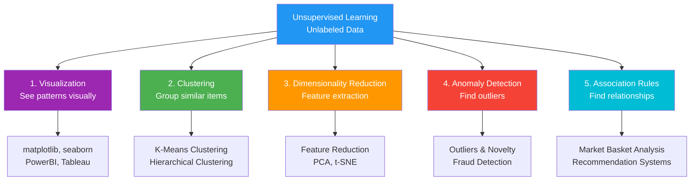
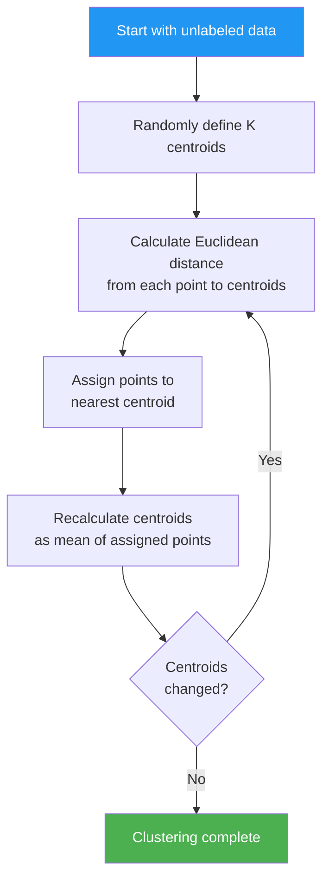
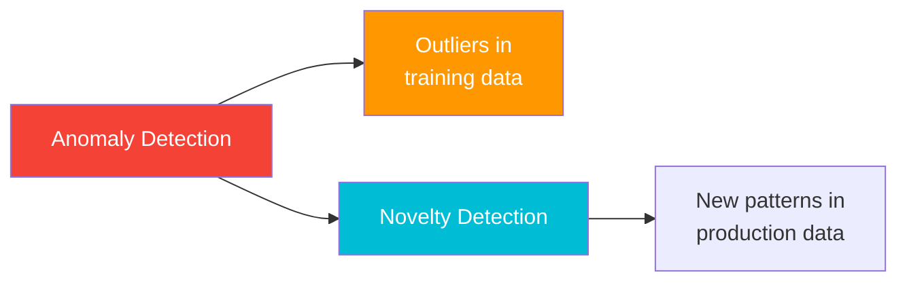
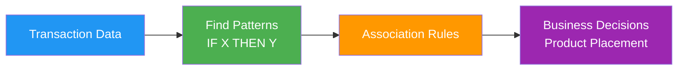

> *Like organizing your closet without labels - you group similar items (colors, types) naturally.*

**Parent Note:** [[1. Types of Machine Learning]]

---

## What is Unsupervised Learning?

In unsupervised learning, we provide **unlabeled data** to our model while training. The model must find patterns and structure in the data on its own.

**Analogy:** *Like being dropped in a foreign city without a map - you explore and find patterns (busy streets, quiet neighborhoods) yourself.*

### Data Structure

**Example Dataset:**

| IQ  | CGPA |
| --- | ---- |
| 85  | 8.9  |
| 90  | 8.0  |
| 75  | 6.0  |

Notice: Only **input features** (IQ and CGPA) are provided. There is **no output/label column** during training.

---

## Types of Unsupervised Learning

---

## 1. Visualization

**Analogy:** *Like creating a map of an unexplored territory - you plot the data to see where things cluster or spread out.*

**Purpose:** Visualizing data to identify patterns, trends, and relationships

### Tools

**Libraries:**
- matplotlib
- seaborn
- plotly

**Software:**
- PowerBI
- Tableau

### Use Case

Plotting customer data to see natural groupings before applying other techniques. For example, visualizing customer income vs spending patterns to identify potential segments.

---

## 2. Clustering

**Analogy:** *Like organizing books in a library without pre-defined categories - you group books by similarity (topic, author, style).*

**Purpose:** Grouping data points based on similarity/density

### K-Means Clustering

**How it works:**

### Process

1. Randomly define K cluster centroids
2. Calculate Euclidean distance between each data point and centroids
3. Assign each point to the nearest centroid
4. Recalculate centroids based on assigned points
5. Repeat until centroids become consistent (converge)

### Advanced Technique

**Hierarchical clustering** can be performed within individual clusters for finer groupings. This creates a tree-like structure of nested clusters.

### Example

**Customer Segmentation:** Grouping customers by purchasing behavior without pre-defined categories. The algorithm might discover segments like "budget shoppers," "luxury buyers," and "seasonal purchasers" naturally from the data.

---

## 3. Dimensionality Reduction

**Also called:** Feature Extraction or Feature Reduction

**Analogy:** *Like summarizing a 300-page book into a 10-page summary - you keep the essential information, discard the redundant.*

**Purpose:** Reduce the number of features while retaining essential information

### Example: House Price Prediction

**Before Dimensionality Reduction:**

1000+ columns including:
- Hall size
- Bedroom 1 size
- Bedroom 2 size
- Bedroom 3 size
- Washroom 1 size
- Washroom 2 size
- Kitchen size
- etc.

**After EDA and Cleaning:**
- Remove missing values
- Remove duplicates
- Identify redundant features

**After Feature Extraction:**
- Replace multiple size columns with: **Total Square Feet Area**
- Single column captures the essence of all individual room sizes

### Benefits

- Faster training
- Less computational cost
- Easier visualization (N-dimensional data can be visualized in 2D/3D)
- Reduced storage requirements
- Removes multicollinearity

### Common Techniques

- **PCA** (Principal Component Analysis)
- **t-SNE** (t-Distributed Stochastic Neighbor Embedding)
- **UMAP** (Uniform Manifold Approximation and Projection)

---

## 4. Anomaly Detection

**Analogy:** *Like a security guard spotting suspicious behavior in a crowd - identifying what doesn't fit the normal pattern.*

**Purpose:** Identification of outliers and unusual patterns

### Anomaly vs Novelty

### Comparison Table

| Aspect | Anomaly | Novelty |
|--------|---------|---------|
| **Definition** | Outliers in existing data | New, previously unseen patterns |
| **When Detected** | During training/analysis | After model deployment |
| **Analogy** | Finding a defective product in a batch | Encountering a completely new product type |
| **Example** | Credit card transaction of $50,000 when usual is $500 | A new type of fraud scheme never seen before |
| **Data State** | Present in historical data | Not in training data, appears later |
| **Action** | Remove or investigate before training | Flag for review, potentially retrain model |
| **Training** | Model learns what's normal AND abnormal | Model only learns what's normal |

### Use Cases

- Fraud detection in banking
- Network intrusion detection
- Manufacturing defect identification
- Health monitoring (detecting abnormal vital signs)
- Credit card fraud detection
- System failure prediction

---

## 5. Association Rule Based Learning

**Analogy:** *Like noticing that people who buy coffee often buy sugar - discovering "if-then" relationships in behavior.*

**Purpose:** Discover interesting relationships between variables in large datasets

### Classic Example: Market Basket Analysis

**The Diaper-Beer Story:**

In the 1990s, a supermarket discovered that men who buy diapers on weekday evenings also tend to buy beer.

**Why?**
- Young fathers sent to buy diapers
- Treat themselves to beer while shopping
- Both purchases happen together

**Business Action:** Place beer near diapers to increase sales

### How It Works

### Common Patterns

- "Customers who bought bread also bought butter"
- "Users who watched Movie A also watched Movie B"
- "People who bought a camera also bought a memory card"
- "Shoppers who buy pasta also buy tomato sauce"

### Applications

- Supermarket product placement
- E-commerce recommendation systems
- Website content suggestions
- Cross-selling strategies
- Promotional bundling
- Inventory management

---

## Quick Summary

| Type | Purpose | Example |
|------|---------|---------|
| **Visualization** | See data patterns | Scatter plots, heatmaps |
| **Clustering** | Group similar data | Customer segmentation |
| **Dimensionality Reduction** | Reduce features | PCA for compression |
| **Anomaly Detection** | Find outliers | Fraud detection |
| **Association Rules** | Find relationships | Market basket analysis |

---

## Related Notes

- [[0. Machine Learning Terms]]
- [[1. Types of Machine Learning]] - Overview of all ML types
- [[2. Supervised Machine Learning]]
- [[4. Semi-Supervised Machine Learning]]

---

#unsupervised-learning #machine-learning #clustering #dimensionality-reduction #anomaly-detection #ai