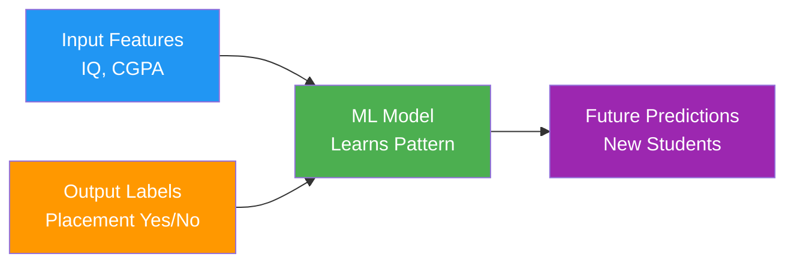
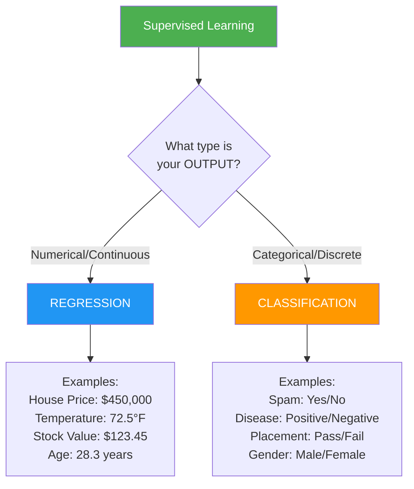
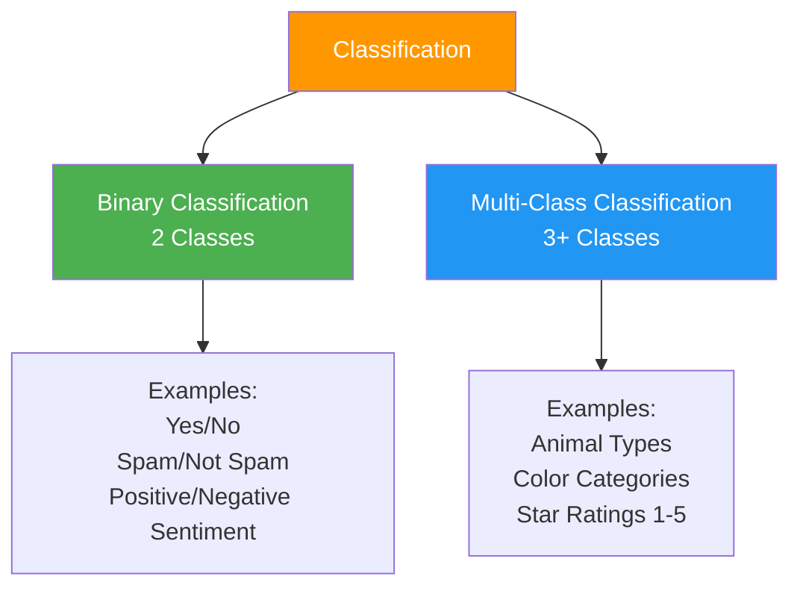
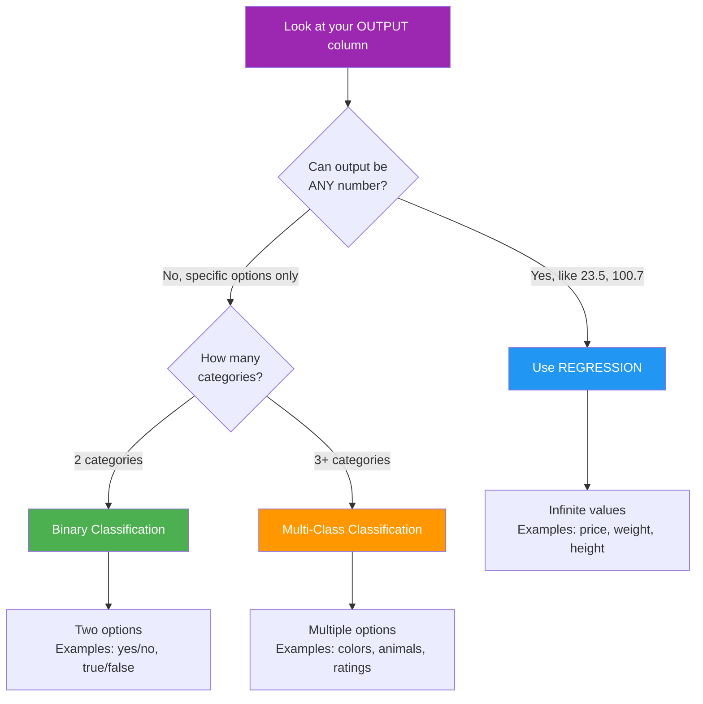

> *Teaching a machine the way you'd teach a child - show examples with answers until they learn the pattern.*

**Parent Note:** [[1. Types of Machine Learning]]

---

## What is Supervised Learning?

In supervised learning, we train models using **labeled data** - both the input AND the correct output.

**Analogy:** *Like flashcards - question on front, answer on back. Keep practicing until you can answer without looking.*

### Training Data Structure

---

## The Two Types: Regression vs Classification

The choice depends on your **output variable type**:

---

## Regression

**Analogy:** *Like predicting someone's height - can be any number within a range (5.7ft, 6.2ft, 5.9ft...).*

### Key Characteristics
- **Output:** Continuous numerical values
- **Range:** Infinite possible values
- **Goal:** Predict a quantity

### Example Dataset

| Square Feet | Bedrooms | Location Score | **Price** |
| ----------- | -------- | -------------- | --------- |
| 1500        | 3        | 8.5            | $350K     |
| 2200        | 4        | 9.2            | $520K     |
| 1100        | 2        | 6.8            | $280K     |

**Question to ask:** *"How much?" or "What value?"*

### Common Use Cases
- House price prediction
- Stock market forecasting
- Temperature prediction
- Age estimation
- Salary prediction

---

## Classification

**Analogy:** *Like sorting mail into bins - each letter goes into a specific category (bills, personal, spam).*

### Key Characteristics
- **Output:** Discrete categories or classes
- **Range:** Limited set of predefined classes
- **Goal:** Predict a category/label

### Example Dataset

| IQ  | CGPA | Study Hours | **Placement** |
| --- | ---- | ----------- | ------------- |
| 85  | 8.9  | 6           | Yes           |
| 90  | 8.0  | 5           | Yes           |
| 75  | 6.0  | 3           | No            |

**Question to ask:** *"Which category?" or "What class?"*

### Types of Classification

### Common Use Cases
- Email spam detection
- Disease diagnosis
- Sentiment analysis
- Image recognition
- Student placement prediction

---

## How to Choose: Decision Tree

---

## Quick Comparison Table

| Aspect | Regression | Classification |
|--------|------------|----------------|
| **Output Type** | Numerical/Continuous | Categorical/Discrete |
| **Examples** | $350,000 / 72.5°F / 25.3 years | Yes/No / Cat/Dog / A/B/C |
| **Question** | "How much?" / "What value?" | "Which category?" / "What class?" |
| **Output Range** | Infinite possibilities | Fixed number of classes |
| **Evaluation** | Error metrics (MAE, RMSE) | Accuracy, Precision, Recall |

---

## Real-World Example Comparison

### Same Input, Different Tasks

**Student Data:**
- Input: IQ, Study Hours, Attendance

#### Regression Task
- **Output:** Predicted CGPA (7.8, 8.5, 6.2...)
- **Type:** Continuous number

#### Classification Task
- **Output:** Pass/Fail
- **Type:** Category

---

## Related Notes

- [[0. Machine Learning Terms]]
- [[1. Types of Machine Learning]] - Overview of all ML types
- [[3. Unsupervised Machine Learning]]
- [[4. Semi-Supervised Machine Learning]]

---

#supervised-learning #machine-learning #regression #classification #ai