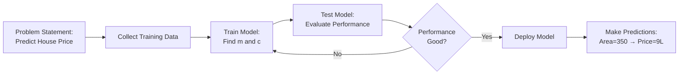

# Regression

A type of supervised machine learning algorithm used to predict a **continuous numerical output (dependent variable)** based on one or more **input features (independent variables)**. Regression models the relationship between variables to make predictions.

**Correction:** Regression identifies the relationship between a dependent variable and one or more independent variables, where the dependent variable is continuous/numerical in nature.

---

## Types of Regression

Regression can be divided into several types, but we'll focus on the three main categories:

1. **Simple Linear Regression**
2. **Multiple Linear Regression**
3. **Polynomial Regression**

---

## 1. Simple Linear Regression

### Definition

Simple Linear Regression models the relationship between **one dependent variable** and **one independent variable** using a linear equation.

### Mathematical Formula
```
y = mx + c + ε
```

Where:
- **y** = dependent variable (target/output we want to predict)
- **x** = independent variable (feature/input)
- **m** = slope (coefficient/weight of the feature)
- **c** = intercept (bias term)
- **ε** (epsilon) = error/noise term (residual)

This is essentially the equation of a straight line.

---

### Example: House Price Prediction

Consider building a house price prediction model based on area:

| Area (sq ft) | Price (Lakhs) |
|--------------|---------------|
| 230          | 5             |
| 300          | 7             |
| 400          | 12            |

**Problem Statement → Model Training → Testing → Deployment**


---

### Model Parameters

Once the model is deployed and we input **area = 350 sq ft**, the model outputs **price = 9 Lakhs**.

**Key Concept:** During training, we ask the model to find the **optimal values of m and c**. These are called **model parameters** (also called weights and bias).

- **x** = area (input)
- **y** = price (actual output)
- **ŷ** (y-hat) = predicted price

The model learns the best values of `m` and `c` from the training data.

---

### Error Calculation

**Error** is the difference between predicted and actual values:
```
Error = ŷ - y
```

Common error metrics used in regression:

1. **Mean Squared Error (MSE)**
```
   MSE = (1/n) Σ(ŷᵢ - yᵢ)²
```

2. **Root Mean Squared Error (RMSE)**
```
   RMSE = √MSE
```

3. **Mean Absolute Error (MAE)**
```
   MAE = (1/n) Σ|ŷᵢ - yᵢ|
```

4. **Mean Bias Error (MBE)**
```
   MBE = (1/n) Σ(ŷᵢ - yᵢ)
```

5. **R² Score (Coefficient of Determination)**
```
   R² = 1 - (SS_res / SS_tot)
```
   - Ranges from 0 to 1 (higher is better)
   - Measures how well the model explains variance in data

6. **Adjusted R²**
```
   Adjusted R² = 1 - [(1-R²)(n-1)/(n-k-1)]
```
   - Penalizes adding unnecessary features
   - Better for multiple regression

---

### Gradient Descent

**Yes, you're correct!** The process of calculating partial derivatives is related to **Gradient Descent**.

To find optimal `m` and `c`, we minimize the error (cost function):

**Cost Function (using MSE):**
```
J(m,c) = (1/n) Σ(ŷᵢ - yᵢ)²
J(m,c) = (1/n) Σ(mxᵢ + c - yᵢ)²
```

**Gradient Descent Updates:**

Calculate partial derivatives:
```
∂J/∂m = (2/n) Σ xᵢ(mxᵢ + c - yᵢ)
∂J/∂c = (2/n) Σ(mxᵢ + c - yᵢ)
```

Update parameters:
```
m = m - α(∂J/∂m)
c = c - α(∂J/∂c)
```

Where **α** (alpha) is the learning rate.

---

### Analytical Solution (Normal Equation)

For simple linear regression, we can also calculate `m` and `c` directly:

**Slope (m):**
```
m = Σ[(xᵢ - x̄)(yᵢ - ȳ)] / Σ(xᵢ - x̄)²
```

**Intercept (c):**
```
c = ȳ - m·x̄
```

Where:
- x̄ = mean of x values
- ȳ = mean of y values

---

### Implementation with NumPy

NumPy provides `polyfit()` for calculating regression parameters directly:
```python
import numpy as np

# Training data
area = np.array([230, 300, 400])
price = np.array([5, 7, 12])

# Calculate m and c using polyfit (degree=1 for linear)
m, c = np.polyfit(area, price, 1)

print(f"Slope (m): {m}")
print(f"Intercept (c): {c}")

# Make prediction
new_area = 350
predicted_price = m * new_area + c
print(f"Predicted price for 350 sq ft: {predicted_price} Lakhs")
```

---

### Book Reference: Simple Linear Regression

From **"Hands-On Machine Learning" by Aurélien Géron**:

> "Linear regression is like fitting a straight line through your data points. The model learns the slope and intercept that minimize the distance between the line and all the points. It's one of the simplest yet most widely used algorithms in practice."

**Analogy:** Think of simple linear regression as finding the "line of best fit" through scattered points on a graph. If you were to draw a straight line that passes as close as possible to all points, that's what linear regression does mathematically.

---

## 2. Multiple Linear Regression

### Definition

Multiple Linear Regression models the relationship between **one dependent variable** and **two or more independent variables**.

### Mathematical Formula
```
y = β₀ + β₁x₁ + β₂x₂ + β₃x₃ + ... + βₙxₙ + ε
```

Where:
- **y** = dependent variable (target)
- **x₁, x₂, ..., xₙ** = independent variables (features)
- **β₀** = intercept (bias)
- **β₁, β₂, ..., βₙ** = coefficients (weights) for each feature
- **ε** = error term

---

### Example: Advanced House Price Prediction

For house price prediction with multiple features:

| Area (sq ft) | Bedrooms | Location Score | Age (years) | Price (Lakhs) |
|--------------|----------|----------------|-------------|---------------|
| 1200         | 2        | 8              | 5           | 45            |
| 1500         | 3        | 9              | 2           | 65            |
| 1800         | 4        | 7              | 10          | 55            |
| 2000         | 3        | 10             | 1           | 85            |

**Equation:**
```
Price = β₀ + β₁(Area) + β₂(Bedrooms) + β₃(Location) + β₄(Age) + ε
```

Each feature has its own coefficient representing its contribution to the final price.

---

### Key Differences from Simple Linear Regression

| Aspect | Simple Linear | Multiple Linear |
|--------|---------------|-----------------|
| **Independent Variables** | 1 | 2 or more |
| **Equation** | y = mx + c | y = β₀ + β₁x₁ + β₂x₂ + ... |
| **Visualization** | 2D line | Hyperplane in n-dimensions |
| **Complexity** | Lower | Higher |

---

### Matrix Representation

Multiple linear regression is often represented using matrices:
```
Y = Xβ + ε
```

Where:
- **Y** = vector of outputs (n × 1)
- **X** = matrix of inputs (n × p), where n = samples, p = features
- **β** = vector of coefficients (p × 1)
- **ε** = vector of errors (n × 1)

**Normal Equation Solution:**
```
β = (XᵀX)⁻¹Xᵀy
```

This gives us the optimal coefficients directly without using gradient descent.

---

### Assumptions of Multiple Linear Regression

1. **Linearity:** The relationship between variables is linear
2. **Independence:** Observations are independent of each other
3. **Homoscedasticity:** Constant variance of errors
4. **Normality:** Errors are normally distributed
5. **No Multicollinearity:** Independent variables are not highly correlated with each other

---

### Feature Importance

In multiple regression, coefficient magnitude indicates feature importance:
```python
# Example coefficients
β₁ (Area) = 0.04        # High impact
β₂ (Bedrooms) = 5.2     # Moderate impact
β₃ (Location) = 3.1     # Moderate impact
β₄ (Age) = -0.8         # Negative impact (older = cheaper)
```

**Interpretation:**
- For every 1 sq ft increase in area, price increases by 0.04 Lakhs (keeping other features constant)
- Each additional bedroom adds 5.2 Lakhs to the price
- Higher location score adds 3.1 Lakhs per point
- Each year of age decreases price by 0.8 Lakhs

---

### Implementation with NumPy and Scikit-Learn

**Using NumPy:**
```python
import numpy as np

# Training data
X = np.array([
    [1200, 2, 8, 5],
    [1500, 3, 9, 2],
    [1800, 4, 7, 10],
    [2000, 3, 10, 1]
])
y = np.array([45, 65, 55, 85])

# Add bias column (for intercept)
X_with_bias = np.c_[np.ones(X.shape[0]), X]

# Calculate coefficients using normal equation
beta = np.linalg.inv(X_with_bias.T @ X_with_bias) @ X_with_bias.T @ y

print("Coefficients:", beta)
```

**Using Scikit-Learn:**
```python
from sklearn.linear_model import LinearRegression

# Training data
X = [[1200, 2, 8, 5],
     [1500, 3, 9, 2],
     [1800, 4, 7, 10],
     [2000, 3, 10, 1]]
y = [45, 65, 55, 85]

# Create and train model
model = LinearRegression()
model.fit(X, y)

print("Intercept (β₀):", model.intercept_)
print("Coefficients (β₁, β₂, β₃, β₄):", model.coef_)

# Make prediction
new_house = [[1600, 3, 8, 3]]
predicted_price = model.predict(new_house)
print(f"Predicted price: {predicted_price[0]} Lakhs")
```

---

### Handling Multicollinearity

When independent variables are highly correlated:

**Detection:**
- **Variance Inflation Factor (VIF)**
```
  VIF > 10 indicates high multicollinearity
```

**Solutions:**
1. Remove highly correlated features
2. Use **Ridge Regression** (L2 regularization)
3. Use **Lasso Regression** (L1 regularization)
4. Use **Principal Component Analysis (PCA)** for dimensionality reduction

---

### Book Reference: Multiple Linear Regression

From **"Introduction to Statistical Learning" by James, Witten, Hastie, Tibshirani**:

> "Multiple linear regression extends the simple linear model by allowing for multiple predictors. Rather than modeling the response as a function of a single predictor, we model it as a function of several predictors. The challenge is that with more predictors comes more complexity and the potential for overfitting."

**Analogy:** If simple linear regression is like predicting someone's weight based only on their height, multiple linear regression is like predicting weight based on height, age, exercise habits, and diet. Each factor contributes to the final prediction with its own weight (coefficient).

---

## 3. Polynomial Regression

### Definition

Polynomial Regression models non-linear relationships by using polynomial terms of the independent variable(s). It's still considered a linear model because it's linear in the coefficients.

### Mathematical Formula

**For degree 2 (quadratic):**
```
y = β₀ + β₁x + β₂x² + ε
```

**For degree 3 (cubic):**
```
y = β₀ + β₁x + β₂x² + β₃x³ + ε
```

**General form (degree n):**
```
y = β₀ + β₁x + β₂x² + β₃x³ + ... + βₙxⁿ + ε
```

---

### When to Use Polynomial Regression

Use polynomial regression when:
- The relationship between variables is **curved** rather than linear
- Simple linear regression has high error
- The scatter plot shows a non-linear pattern

**Warning:** Higher degree polynomials can lead to **overfitting**. Usually, degrees 2-4 are sufficient for most real-world problems.

---

### Example: Temperature vs Ice Cream Sales

| Temperature (°C) | Ice Cream Sales |
|------------------|-----------------|
| 15               | 20              |
| 20               | 40              |
| 25               | 80              |
| 30               | 140             |
| 35               | 220             |

A linear model might not fit well here because the relationship accelerates. A quadratic model would be better:
```
Sales = β₀ + β₁(Temp) + β₂(Temp)²
```

---

### Implementation
```python
import numpy as np
from sklearn.preprocessing import PolynomialFeatures
from sklearn.linear_model import LinearRegression
import matplotlib.pyplot as plt

# Data
X = np.array([15, 20, 25, 30, 35]).reshape(-1, 1)
y = np.array([20, 40, 80, 140, 220])

# Create polynomial features (degree=2)
poly_features = PolynomialFeatures(degree=2, include_bias=False)
X_poly = poly_features.fit_transform(X)

# Train model
model = LinearRegression()
model.fit(X_poly, y)

# Predict
X_test = np.array([[22], [28], [32]])
X_test_poly = poly_features.transform(X_test)
predictions = model.predict(X_test_poly)

print("Predictions:", predictions)
```

---

### Visual Comparison

**Linear vs Polynomial Fit:**

- **Linear Regression:** Straight line (may underfit curved data)
- **Polynomial Regression (degree 2):** Parabola (captures curvature)
- **Polynomial Regression (degree 10):** Highly curved (may overfit)

---

### Book Reference: Polynomial Regression

From **"Pattern Recognition and Machine Learning" by Christopher Bishop**:

> "Polynomial regression provides a simple way to provide a non-linear fit to data. However, we must be careful about the choice of polynomial degree. Too low a degree leads to underfitting, while too high a degree leads to overfitting, where the model fits the noise in the training data rather than the underlying pattern."

**Analogy:** Imagine fitting a path through a hilly terrain. Linear regression draws a straight road (ignoring the hills), polynomial regression of degree 2 creates a smooth curved highway that follows the major contours, but polynomial regression of degree 100 would create a roller coaster that goes through every tiny bump and pothole – technically accurate for training data but useless for new terrain.

---

## Comparison Summary

| Type | Variables | Use Case | Equation |
|------|-----------|----------|----------|
| **Simple Linear** | 1 input, 1 output | Basic linear relationships | y = mx + c |
| **Multiple Linear** | Multiple inputs, 1 output | Multiple factors affect outcome | y = β₀ + β₁x₁ + β₂x₂ + ... |
| **Polynomial** | 1+ inputs with powers, 1 output | Non-linear relationships | y = β₀ + β₁x + β₂x² + ... |

---

## 📖 From Class Notes

### Housing Dataset Activity from Lecture

The class included a hands-on activity using a housing dataset. Key steps from the lecture:

**1. Load and explore the data:**
```python
import pandas as pd
import matplotlib.pyplot as plt
import seaborn as sns
import warnings
warnings.filterwarnings('ignore')

df = pd.read_csv('housing.csv')
df.shape  # Check size
df.info()  # Check columns, types, nulls
df.head()  # Preview data
df.describe()  # Statistical summary
```

**2. Visualize relationship:**
```python
# Scatter plot to see correlation between area and price
sns.scatterplot(df, x='area', y='price')
plt.show()
```

**3. Handle outliers using IQR method:**
```python
# For price column
q1 = df['price'].quantile(0.25)
q3 = df['price'].quantile(0.75)
iqr = q3 - q1
lwb = q1 - 1.5 * iqr
uwb = q3 + 1.5 * iqr
df = df[(df['price'] >= lwb) & (df['price'] <= uwb)]

# Apply same to area column
q1 = df['area'].quantile(0.25)
q3 = df['area'].quantile(0.75)
iqr = q3 - q1
lwb = q1 - 1.5 * iqr
uwb = q3 + 1.5 * iqr
df = df[(df['area'] >= lwb) & (df['area'] <= uwb)]
```

This demonstrates the complete workflow: load → explore → visualize → clean → model.

---

## Key Takeaways

1. **Regression predicts continuous values** (unlike classification which predicts categories)
2. **Model parameters are learned** during training (m, c, or β coefficients)
3. **Gradient descent or normal equation** can find optimal parameters
4. **Error metrics** help evaluate model performance
5. **More features ≠ Better model** – beware of overfitting and multicollinearity
6. **Start simple** (linear) and increase complexity only if needed


