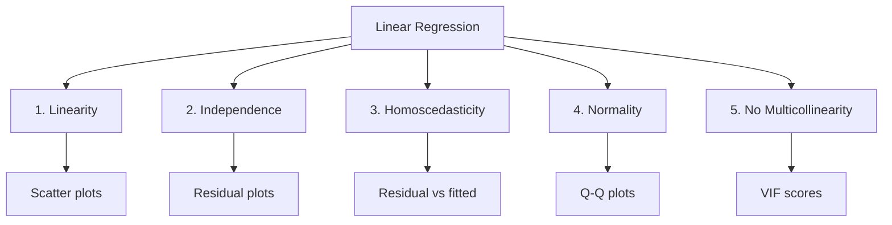

# Assumptions of Linear Regression

## Overview

Linear regression is a powerful and widely used technique, but it makes specific assumptions about the data. When these assumptions are violated, model predictions become unreliable, and statistical inferences (like confidence intervals and p-values) may be incorrect. Understanding these assumptions is crucial for proper model application and for diagnosing when linear regression is inappropriate.

The good news is that many of these assumptions can be tested, and there are remedies when they're violated. This knowledge is essential for any data scientist building regression models.

## The Five Classical Assumptions



## 1. Linearity

### The Assumption

The relationship between each independent variable and the dependent variable is **linear**. This means that a change in $x$ produces a constant change in $y$, regardless of the value of $x$.

### How to Test

- **Scatter plot**: Plot each feature vs the target
- **Residual plots**: Plot residuals vs predicted values
- **Component+Component (C-C) plots**: Check linear relationship

### Violation Indicators

- Curved patterns in scatter plots
- Systematic patterns in residual plots
- Low R² despite seemingly relevant features

### Solutions

- **Transform variables**: Use log, square root, or polynomial terms
- **Add polynomial features**: $x^2$, $x^3$
- **Non-linear models**: Decision trees, neural networks

## 2. Independence (No Autocorrelation)

### The Assumption

Observations are independent of each other. The value of one observation does not influence or relate to another.

### Why It Matters

Standard errors are underestimated when observations are correlated, leading to:
- Overconfident predictions
- Incorrect hypothesis tests
- False "statistically significant" results

### How to Test

- **Durbin-Watson test**: Values near 2 indicate no autocorrelation
- **Residual time series plots**: Look for patterns over time
- ** Ljung-Box test**: Tests for autocorrelation in residuals

### Violation Indicators

- Durbin-Watson ≠ 2
- Patterns in residual time series
- Data collected over time/space (time series, spatial data)

### Solutions

- **Time series models**: ARIMA, etc.
- **Include time features**: Day, month, trend
- **Generalized Least Squares**: Accounts for correlation

## 3. Homoscedasticity (Constant Variance)

### The Assumption

The variance of residuals is constant across all levels of independent variables. Errors have equal spread regardless of prediction magnitude.

```
     Homoscedastic:          Heteroscedastic:
     
     ●  ●                        ●●
    ● ● ●                      ●  ●
    ●● ●● ●●                   ●   ●●
    ● ●● ●● ●                  ●     ●●
    └──────────                └──────────
     Predicted                  Predicted
     
     Equal variance             Cone shape (bad!)
```

### How to Test

- **Residuals vs fitted plot**: Look for funnel shape
- **Breusch-Pagan test**: Statistical test for heteroscedasticity
- **White's test**: More general test

### Violation Indicators

- Funnel/cone shape in residuals vs fitted
- Increasing spread as predictions increase
- Small R² despite good fit

### Solutions

- **Transform target**: Log, square root transformation
- **Weighted regression**: Give less weight to high-variance observations
- **Robust standard errors**: Correct standard errors for heteroscedasticity
- **Heteroscedasticity-consistent (HC) standard errors**

## 4. Normality of Residuals

### The Assumption

The residuals (errors) are normally distributed. This assumption matters primarily for:
- Confidence intervals
- Hypothesis testing (p-values)
- Small sample sizes

### How to Test

- **Q-Q plot**: Compare residual distribution to normal
- **Shapiro-Wilk test**: Statistical test for normality
- **Histogram of residuals**: Visual check

### Violation Indicators

- S-curve or heavy tails in Q-Q plot
- Skewed histogram of residuals
- Significant Shapiro-Wilk test

### Solutions

- **Transform target variable**: Log, Box-Cox
- **Increase sample size**: Central Limit Theorem helps
- **Non-parametric methods**: Don't assume normality
- **Bootstrapping**: For confidence intervals

**Note**: For large samples (n > 30), normality assumption is less critical due to the Central Limit Theorem.

## 5. No Multicollinearity

### The Assumption

Independent variables are not highly correlated with each other. Each feature should provide unique information.

### Why It Matters

- Unstable coefficient estimates (small data changes → large coefficient changes)
- Impossible to interpret individual coefficients
- Standard errors become huge

### How to Test

- **Correlation matrix**: Check pairwise correlations
- **Variance Inflation Factor (VIF)**: VIF > 10 indicates problem
  $$VIF_i = \frac{1}{1 - R_i^2}$$
- **Eigenvalue decomposition**: Near-zero eigenvalues indicate issues

### Violation Indicators

- VIF > 10 for any feature
- Correlations > 0.8 between features
- Coefficient signs that don't make sense
- Model changes drastically when features added/removed

### Solutions

- **Remove one correlated feature**
- **Combine features**: Create an index
- **Principal Component Analysis (PCA)**: Create uncorrelated components
- **Ridge/Lasso regression**: Regularization handles multicollinearity

## Quick Reference Table

| Assumption | What It Means | Test | Solution if Violated |
|-----------|--------------|------|-------------------|
| **Linearity** | Straight relationship | Scatter plot | Transform, polynomial |
| **Independence** | No correlation | Durbin-Watson | Time series models |
| **Homoscedasticity** | Equal variance | Residuals plot | Transform, weighted |
| **Normality** | Normal errors | Q-Q plot | Transform, bootstrap |
| **No Multicollinearity** | Features uncorrelated | VIF | Remove, PCA, Ridge |

## Checking Assumptions in Python

```python
import numpy as np
import pandas as pd
import matplotlib.pyplot as plt
from sklearn.linear_model import LinearRegression
from statsmodels.stats.outliers_influence import variance_inflation_factor
import scipy.stats as stats

# Fit model
model = LinearRegression()
model.fit(X, y)
y_pred = model.predict(X)
residuals = y - y_pred

# 1. Linearity: Residuals vs Fitted
plt.figure(figsize=(12, 4))
plt.subplot(1, 4, 1)
plt.scatter(y_pred, residuals)
plt.axhline(y=0, color='r', linestyle='--')
plt.xlabel('Fitted values')
plt.ylabel('Residuals')
plt.title('Check Linearity')

# 2. Normality: Q-Q Plot
plt.subplot(1, 4, 2)
stats.probplot(residuals, dist="norm", plot=plt)
plt.title('Q-Q Plot')

# 3. Homoscedasticity: Scale-Location
plt.subplot(1, 4, 3)
plt.scatter(y_pred, np.sqrt(np.abs(residuals)))
plt.xlabel('Fitted values')
plt.ylabel('√|Residuals|')
plt.title('Scale-Location')

# 4. Multicollinearity: VIF
plt.subplot(1, 4, 4)
vif_data = pd.DataFrame()
vif_data["feature"] = X.columns
vif_data["VIF"] = [variance_inflation_factor(X.values, i) for i in range(X.shape[1])]
print(vif_data)

plt.tight_layout()
plt.show()
```

## 📖 From Class Notes

### Code Example from Lecture

The class notes provide a complete example for checking assumptions:

```python
import numpy as np
import pandas as pd
import statsmodels.api as sm
import matplotlib.pyplot as plt
import seaborn as sns

# Generate dummy data
np.random.seed(42)
X = np.random.rand(100, 1) * 10
y = 2.5 * X + np.random.normal(0, 2, (100, 1))

# Fit OLS model
X_with_const = sm.add_constant(X)
model = sm.OLS(y, X_with_const).fit()

# Calculate residuals
residuals = model.resid
fitted_values = model.predict(X_with_const)
```

### Linearity Check from Class

From lecture: "The first and most crucial assumption is that a linear relationship exists between the independent variable(s) and the dependent variable. This means that the change in the dependent variable is proportional to the change in the independent variable."

**Consequences of violation**: If the relationship is non-linear, a linear regression model will fail to capture the true underlying pattern, leading to biased estimates and poor predictive performance.

### Residual Analysis

The class notes emphasize checking residuals using:
- Scatter plots: Plot dependent variable against each independent variable
- Residual plots: Plot residuals against predicted values—if linear, residuals should be randomly scattered around zero

---

## Interview Questions

**Q: Which assumption is most important?**
Linearity is often considered most important because if the relationship is non-linear, the model fundamentally misunderstands the data. However, all assumptions matter for accurate inference.

**Q: What happens if assumptions are violated?**
Predictions may still be okay, but:
- Confidence intervals become unreliable
- P-values and hypothesis tests become invalid
- Coefficient interpretations become incorrect

**Q: Can you still use linear regression if assumptions are violated?**
Often yes, but with caution:
- Predictions may still be useful even with violations
- Consider robust methods (sandwich estimators, bootstrapping)
- Transformations can fix many issues

**Q: How is multicollinearity different from the other assumptions?**
Multicollinearity is about relationships between features (X variables), while the other assumptions concern relationships between features and target (X → y), or properties of errors.

## Summary

Linear regression makes five key assumptions:
1. **Linearity**: X → y relationship is linear
2. **Independence**: Observations don't influence each other
3. **Homoscedasticity**: Error variance is constant
4. **Normality**: Errors are normally distributed (for inference)
5. **No multicollinearity**: Features aren't highly correlated

Each can be tested and addressed. Violations don't always invalidate the model but require caution in interpretation.

## Related Notes

- [[02. Mean Squared Error]]
- [[03. Linear Regression Basics/04. Best Line Metrics|Best Line Metrics]]
- [[06. Advanced Regression/01. Multiple Linear Regression]]

## Resources

- Lectures: 10-12
- Book: "Introduction to Statistical Learning" Chapter 3
