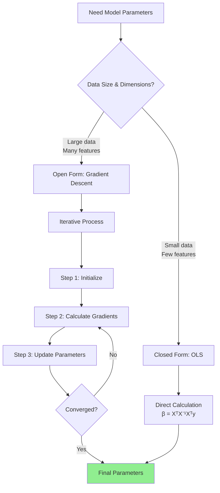

## What are Model Parameters?

Model parameters are the **outputs** derived from training a model. They define the relationship between input features and target variable.

### In Linear Regression

```
y = mx + c
```

or equivalently:

```
y = β₁x + β₀
```

Where:

- `m` or `β₁` = slope/weight
- `c` or `β₀` = intercept/bias

---

## Two Approaches to Derive Model Parameters

### 1. Closed Form Solution

#### Ordinary Least Squares (OLS)

Uses a **direct mathematical formula** to calculate parameters in one step.

#### Formula

For simple linear regression:

```
β₁ = Σ(xi - x̄)(yi - ȳ) / Σ(xi - x̄)²

β₀ = ȳ - β₁x̄
```

For multiple linear regression (matrix form):

```
β = (XᵀX)⁻¹Xᵀy
```

Where:

- `X` = feature matrix
- `y` = target vector
- `Xᵀ` = transpose of X
- `(XᵀX)⁻¹` = inverse of XᵀX

#### Advantages

1. **Exact solution** - calculates optimal parameters directly
2. **No iterations** - single computation gives final answer
3. **No hyperparameters** - no learning rate or convergence criteria needed
4. **Fast for small data** - efficient when dataset is small

#### Disadvantages

1. **Matrix inversion required** - computing `(XᵀX)⁻¹` is expensive
2. **High computational cost** - O(n³) complexity for n features
3. **Memory intensive** - must load entire dataset and compute large matrices
4. **Not scalable** - breaks down with large number of features (1000+)
5. **Numerical instability** - matrix may not be invertible

#### Best For

- Small datasets
- Low number of dimensions (features < 100)
- 1D or 2D data
- When exact solution is needed quickly

#### When OLS Fails

```
With 1000 features:
- Matrix size: 1000 × 1000 = 1,000,000 elements
- Inversion time: computationally prohibitive
- Memory: may exceed available RAM
```

---

### 2. Open Form Solution

#### Gradient Descent

Uses **iterative optimization** to find parameters gradually.

#### Core Concept

Instead of calculating parameters directly, gradient descent:

1. Starts with random guess
2. Improves parameters step by step
3. Moves in direction that reduces error
4. Repeats until convergence

#### Advantages

1. **Scalable** - works with any number of features
2. **Memory efficient** - processes data in batches
3. **No matrix inversion** - avoids computational bottleneck
4. **Flexible** - works with various loss functions
5. **Handles large datasets** - can process millions of samples

#### Disadvantages

1. **Requires iterations** - takes multiple steps to converge
2. **Needs hyperparameter tuning** - learning rate, batch size, etc.
3. **Approximate solution** - may not reach exact minimum
4. **Slower for small data** - overhead not justified for tiny datasets

#### Best For

- Large datasets
- High dimensional data (many features)
- When exact solution is computationally infeasible
- Online learning scenarios

---

## The 4 Steps of Gradient Descent

### Step 1: Initialize Parameters

Randomly assign values to model parameters.

```
β₀ = random_value  (e.g., 0 or small random number)
β₁ = random_value  (e.g., 0 or small random number)
```

Common initialization:

- Zero initialization: `β₀ = 0, β₁ = 0`
- Random initialization: `β₀ = rand(), β₁ = rand()`

### Step 2: Calculate Partial Derivatives

Compute gradients of loss function with respect to each parameter.

```
∂Loss/∂β₁ = ∂J/∂β₁ = -(2/n) Σ xi(yi - ŷi)

∂Loss/∂β₀ = ∂J/∂β₀ = -(2/n) Σ (yi - ŷi)
```

Where:

- `J` = cost/loss function (MSE)
- `ŷi` = predicted value = `β₁xi + β₀`
- `yi` = actual value
- `n` = number of samples

### Step 3: Update Parameters

Calculate new parameter values using gradient descent update rule.

```
β₁_new = β₁_old - α * (∂J/∂β₁)

β₀_new = β₀_old - α * (∂J/∂β₀)
```

Where:

- `α` = learning rate (controls step size)
- Typical values: 0.001, 0.01, 0.1

### Step 4: Repeat

**Steps 1, 2, and 3 together form ONE iteration.**

Repeat the process:

```
Iteration 1: Initialize → Calculate gradients → Update parameters
Iteration 2: Calculate gradients → Update parameters
Iteration 3: Calculate gradients → Update parameters
...
Continue until convergence
```

#### Convergence Criteria

Stop when:

- Cost function change is minimal: `|J_t - J_(t-1)| < ε`
- Maximum iterations reached
- Gradients become very small

---

## Comparison: Closed Form vs Open Form

|Aspect|Closed Form (OLS)|Open Form (GD)|
|---|---|---|
|**Computation**|Direct formula|Iterative|
|**Speed**|Fast (small data)|Slower initially|
|**Scalability**|Poor (high dims)|Excellent|
|**Memory**|High|Low-Medium|
|**Accuracy**|Exact|Approximate|
|**Features**|< 100|Unlimited|
|**Iterations**|1 (single step)|Many|
|**Matrix inversion**|Required|Not required|

---

## Decision Framework

### Use Closed Form (OLS) when:

- Dataset has < 10,000 samples
- Number of features < 100
- Exact solution needed
- Have sufficient memory
- One-time computation

### Use Open Form (Gradient Descent) when:

- Large datasets (10,000+ samples)
- High dimensional data (100+ features)
- Limited memory
- Need scalability
- Online/streaming data
- Working with non-linear models later

---

## Visual Representation



---

## Key Takeaways

1. **Model parameters** (m, c or β₁, β₀) define the regression line
2. **Closed form** gives exact solution but doesn't scale
3. **Open form** uses iteration but handles large-scale problems
4. **Gradient descent** is the foundation for modern machine learning
5. Choice depends on **data size** and **number of features**

The next step is understanding the different types of gradient descent (batch, stochastic, mini-batch) and their trade-offs.