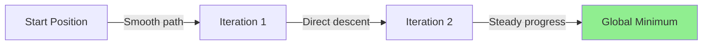

## Core Concept

Gradient descent is an optimization algorithm used to minimize the cost function by iteratively adjusting parameters in the direction of steepest descent.

### Cost Function (Mean Squared Error)

```
J(m, c) = (1/n) Σ(yi - (mxi + c))²
```

Where:

- `m` = slope/weight
- `c` = intercept/bias
- `n` = number of data points
- `yi` = actual value
- `mxi + c` = predicted value

### Parameter Update Rule

```
m = m - α * ∂J/∂m
c = c - α * ∂J/∂c
```

Where `α` is the learning rate.

### Partial Derivatives

```
∂J/∂m = -(2/n) Σ xi(yi - (mxi + c))
∂J/∂c = -(2/n) Σ (yi - (mxi + c))
```

---

## 1. Batch Gradient Descent

Uses the **entire dataset** in each iteration to compute gradients.

### Algorithm

```
For each iteration:
    1. Calculate predictions for ALL n samples: ŷi = mxi + c
    2. Compute cost: J = (1/n) Σ(yi - ŷi)²
    3. Calculate gradients using ALL samples:
       ∂J/∂m = -(2/n) Σ xi(yi - ŷi)
       ∂J/∂c = -(2/n) Σ (yi - ŷi)
    4. Update parameters:
       m = m - α * ∂J/∂m
       c = c - α * ∂J/∂c
```

### Convergence Path



### Advantages

1. **Stable convergence** - moves directly toward minimum with smooth trajectory
2. **Exact gradient** - uses complete information from entire dataset
3. **Finds true minimum** - for convex problems, guarantees global minimum
4. **Predictable behavior** - consistent step directions

### Disadvantages

1. **Slow for large datasets** - must process all samples before single update
2. **Memory intensive** - requires loading entire dataset into memory
3. **Computationally expensive** - O(n) operations per iteration
4. **Not suitable for online learning** - cannot update with streaming data

### Best For

- Small datasets (n < 10,000)
- Low number of features
- When precision is critical
- Convex optimization problems

---

## 2. Stochastic Gradient Descent (SGD)

Uses **one random sample** per iteration to compute gradients.

### Algorithm

```
For each iteration:
    1. Randomly select ONE sample (xi, yi)
    2. Calculate prediction: ŷi = mxi + c
    3. Compute gradients using ONLY this sample:
       ∂J/∂m = -2 * xi(yi - ŷi)
       ∂J/∂c = -2 * (yi - ŷi)
    4. Update parameters:
       m = m - α * ∂J/∂m
       c = c - α * ∂J/∂c
```

### Student Analogy

**Batch GD**: Teacher addresses all 500 students' doubts in all 10 topics, then updates teaching approach once.

**SGD**: Teacher picks one random student, addresses their doubt in one topic, updates approach immediately. Repeats with different random students.

### Convergence Path


### Advantages

1. **Fast updates** - parameter update after each sample
2. **Low memory** - processes one sample at a time
3. **Computationally efficient** - O(1) per iteration
4. **Can escape local minima** - noise helps jump out of shallow minima
5. **Online learning** - can update with streaming data
6. **Works with large datasets** - doesn't need all data in memory

### Disadvantages

1. **Noisy convergence** - erratic path with high variance
2. **Oscillations around minimum** - never settles exactly at minimum
3. **Less precise** - gradient estimate based on single sample
4. **Requires learning rate decay** - need to reduce α over time
5. **Unstable** - can overshoot or diverge with poor learning rate

---

## 3. Mini-Batch Gradient Descent

Uses **small batches of samples** per iteration to compute gradients.

### Algorithm

```
For each iteration:
    1. Randomly select a BATCH of b samples (typically 32, 64, 128, 256)
    2. Calculate predictions for batch: ŷi = mxi + c
    3. Compute gradients using batch:
       ∂J/∂m = -(2/b) Σ(batch) xi(yi - ŷi)
       ∂J/∂c = -(2/b) Σ(batch) (yi - ŷi)
    4. Update parameters:
       m = m - α * ∂J/∂m
       c = c - α * ∂J/∂c
```

### Student Analogy

Teacher groups 500 students into batches of 50. Addresses one batch's doubts, updates teaching approach, then moves to next batch.

### Convergence Path


### Advantages

1. **Balanced speed** - faster than batch, more stable than SGD
2. **Reduced variance** - smoother than SGD, better gradient estimate
3. **Vectorization** - efficient matrix operations on GPU/CPU
4. **Memory efficient** - doesn't need entire dataset in memory
5. **Good convergence** - combines benefits of both batch and SGD
6. **Parallelizable** - batch operations leverage hardware acceleration

### Disadvantages

1. **Hyperparameter tuning** - need to choose batch size
2. **Still has some noise** - more than batch GD
3. **May need learning rate scheduling** - for best results

### Common Batch Sizes

- 32: small datasets, faster iterations
- 64: good default choice
- 128: balanced performance
- 256: large datasets, smoother gradients

---

## Comparison Table

|Aspect|Batch GD|SGD|Mini-Batch GD|
|---|---|---|---|
|**Samples per update**|All (n)|1|b (32-256)|
|**Speed**|Slow|Fast|Medium-Fast|
|**Memory**|High|Low|Medium|
|**Convergence**|Smooth|Noisy|Moderate|
|**Precision**|Exact|Approximate|Good|
|**Use case**|Small data|Large data|Most cases|

---

## Common Issues and Concepts

### 1. Oscillations

Occur when learning rate is too high or using SGD.

```
Cost function oscillates around minimum instead of smoothly converging
```

**Causes**:

- Learning rate too large
- High variance in SGD
- Non-convex landscape

**Solutions**:

- Reduce learning rate
- Use learning rate decay
- Switch to mini-batch
- Add momentum

### 2. Saddle Points

Points where gradient is zero but not a minimum.

```
∂J/∂m = 0 and ∂J/∂c = 0, but not at minimum
```

**Characteristics**:

- Gradient vanishes
- Algorithm gets stuck
- Common in high-dimensional spaces

**Solutions**:

- Use momentum-based methods
- Add noise (SGD helps escape)
- Use adaptive learning rates (Adam, RMSprop)

### 3. Local vs Global Minima


**For Linear Regression**: Cost function is convex, only one global minimum exists.

**For Non-linear Models**: Multiple local minima possible, SGD noise helps exploration.

### 4. Learning Rate Impact

```
α too small: slow convergence, many iterations needed
α optimal: fast and stable convergence
α too large: divergence, overshooting minimum
```

**Typical values**: 0.001, 0.01, 0.1

### 5. Convergence Criteria

Stop when:

```
|J(iteration_t) - J(iteration_t-1)| < ε
```

Where ε is a small threshold (e.g., 0.0001)

---

## Practical Implementation Tips

### Batch Gradient Descent

```python
# Pseudocode
for epoch in range(max_iterations):
    predictions = m * X + c
    dm = -(2/n) * sum(X * (y - predictions))
    dc = -(2/n) * sum(y - predictions)
    m = m - learning_rate * dm
    c = c - learning_rate * dc
```

### Stochastic Gradient Descent

```python
# Pseudocode
for epoch in range(max_epochs):
    for i in random_order(n):
        prediction = m * X[i] + c
        dm = -2 * X[i] * (y[i] - prediction)
        dc = -2 * (y[i] - prediction)
        m = m - learning_rate * dm
        c = c - learning_rate * dc
```

### Mini-Batch Gradient Descent

```python
# Pseudocode
batch_size = 64
for epoch in range(max_epochs):
    for batch in create_batches(X, y, batch_size):
        predictions = m * batch_X + c
        dm = -(2/batch_size) * sum(batch_X * (batch_y - predictions))
        dc = -(2/batch_size) * sum(batch_y - predictions)
        m = m - learning_rate * dm
        c = c - learning_rate * dc
```

---

## Summary

The choice depends on dataset size, computational resources, and precision requirements.

## 📖 From Class Notes

### The Learning Rate (η) from Lecture

The learning rate is a tuning parameter that determines the step size at every iteration while moving toward a minimum of a loss function. The learning rate can determine whether a model delivers optimal performance or fails to learn during the training process.

**Key insight**: Too small = slow convergence; Too large = overshooting/divergence.

### Gradient Descent Algorithm Steps from Class

1. **Initialize Parameters**: Start with random values for parameters (β), the intercept (β₀), and the learning rate (η)
2. **Compute Prediction**: Calculate prediction using current parameters
3. **Calculate Error**: Find difference between predicted and actual values
4. **Compute Gradient**: Calculate derivative of cost function with respect to each parameter
5. **Update Parameters**: Adjust parameters in the opposite direction of the gradient
6. **Repeat** until convergence