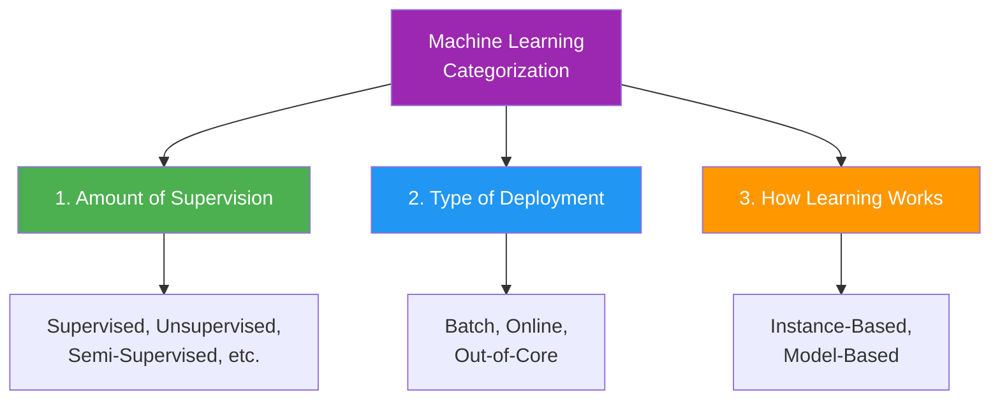
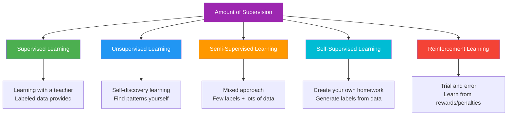
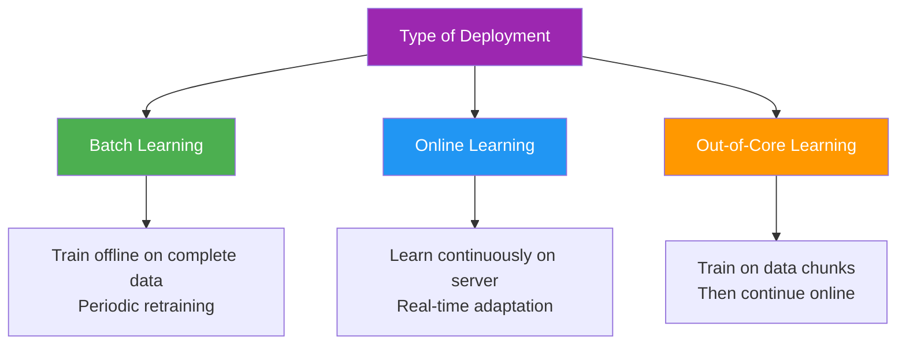
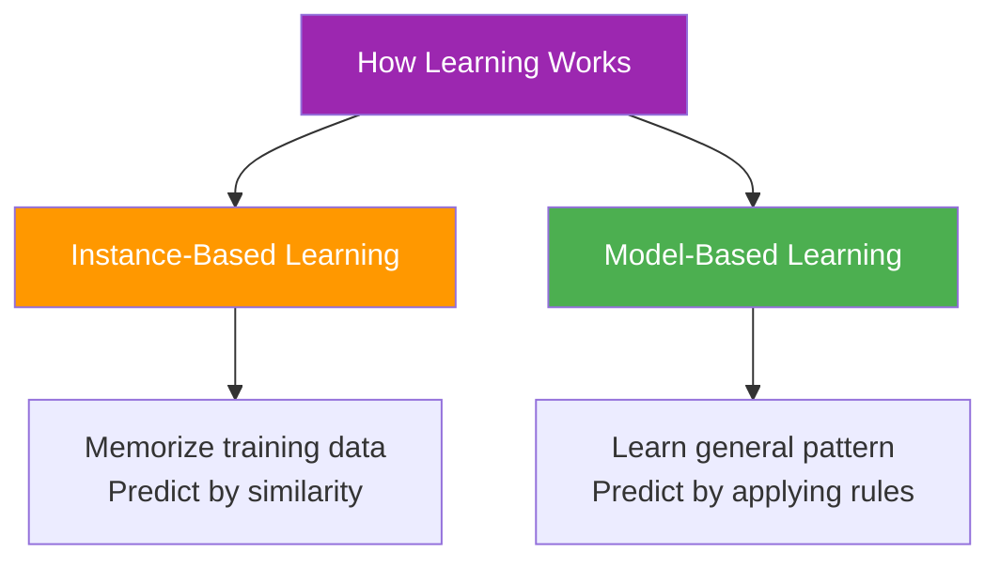
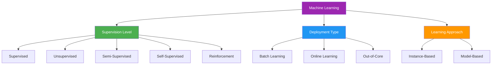

> *Machine learning can be categorized in multiple ways - by supervision, deployment, or learning approach.*

---

## Ways to Categorize Machine Learning

There are multiple ways to categorize machine learning approaches:

---

## Category 1: Amount of Supervision Required

Machine learning algorithms can be categorized based on the **level of supervision** they need during training:

### 1. [[2. Supervised Machine Learning|Supervised Machine Learning]]

**Analogy:** *Like learning math with an answer key - you see the problem AND the solution.*

- **Data:** Input features + Output labels
- **Goal:** Learn the mapping from inputs to outputs
- **Types:** [[2. Supervised Machine Learning#Regression|Regression]], [[2. Supervised Machine Learning#Classification|Classification]]

**Example Dataset:**
| IQ  | CGPA | Placement |
| --- | ---- | --------- |
| 85  | 8.9  | Yes       |
| 90  | 8.0  | Yes       |
| 75  | 6.0  | No        |

---

### 2. [[3. Unsupervised Machine Learning|Unsupervised Machine Learning]]

**Analogy:** *Like organizing your closet without labels - you group similar items (colors, types) naturally.*

- **Data:** Only input features (no labels)
- **Goal:** Discover hidden patterns or structure

**Types:** Visualization, Clustering, Dimensionality Reduction, Anomaly Detection, Association Rules

**Examples:**
- Customer segmentation (clustering)
- Fraud detection (anomaly detection)
- "Customers who bought X also bought Y" (association rules)

---

### 3. [[4. Semi-Supervised Machine Learning|Semi-Supervised Machine Learning]]

**Analogy:** *Like learning from a few textbook examples, then practicing with unlabeled problems.*

- **Data:** Small amount of labeled + Large amount of unlabeled
- **Use Case:** Labeling data is expensive/time-consuming
- **Example:** You have 100 labeled medical images but 10,000 unlabeled ones

---

### 4. [[5. Self-Supervised Machine Learning|Self-Supervised Learning]]

**Analogy:** *Like learning a language by predicting the next word in a sentence - you create your own exercises from raw text.*

- **Data:** Unlabeled data that creates its own labels
- **Examples:** 
  - Predict next word in sentence
  - Predict masked portions of images
  - Predict image rotation angle

---

### 5. [[6. Reinforcement Learning|Reinforcement Learning]]

**Analogy:** *Like training a dog - reward good behavior (sit = treat), penalize bad behavior (bark = no treat).*

- **Components:** Agent, Environment, Actions, Rewards/Penalties
- **Goal:** Maximize cumulative reward
- **Examples:** Game AI, robotics, self-driving cars

---

## Category 2: Type of Deployment / Incremental Learning

Machine learning systems can be categorized based on **how they handle new data** during and after deployment:

### 1. [[Machine Learning Deployment Types#1. Batch Learning (Offline Learning)|Batch Learning]]

- **Training:** Offline with complete dataset
- **Updates:** Periodic retraining required
- **Use Case:** Data changes slowly (house prices, annual forecasts)

### 2. [[Machine Learning Deployment Types#2. Online Learning (Incremental Learning)|Online Learning]]

- **Training:** Continuous on deployment server
- **Updates:** Real-time, automatic
- **Use Case:** Dynamic data (stock trading, social media feeds)

### 3. [[Machine Learning Deployment Types#3. Out-of-Core Learning|Out-of-Core Learning]]

- **Training:** Data divided into chunks
- **Updates:** After chunks, switches to online learning
- **Use Case:** Datasets too large for memory (big data applications)

---

## Category 3: How the Model Learns

Machine learning can be categorized based on **how predictions are made**:

### 1. [[Instance-Based vs Model-Based Learning#1. Instance-Based Learning|Instance-Based Learning]]

- **Approach:** Memorize all training examples
- **Prediction:** Find similar examples and use their outputs
- **Deployment:** Requires all training data at deployment
- **Examples:** K-Nearest Neighbors (KNN), K-Means

### 2. [[Instance-Based vs Model-Based Learning#2. Model-Based Learning|Model-Based Learning]]

- **Approach:** Learn generalized pattern or formula
- **Prediction:** Apply learned pattern to new data
- **Deployment:** Only model needed, not training data
- **Examples:** Linear Regression, SVM, Neural Networks

---

## Complete Overview

---

## Quick Comparison: Supervision Level

| Type | Supervision | Use Case |
|------|-------------|----------|
| **Supervised** | Full labels | Prediction with known outcomes |
| **Unsupervised** | No labels | Pattern discovery |
| **Semi-Supervised** | Few labels | Limited labeled data |
| **Self-Supervised** | Auto-generated | Learn from structure |
| **Reinforcement** | Rewards/Penalties | Sequential decision-making |

---

## Quick Comparison: Deployment Type

| Type | Training Location | Updates | Use Case |
|------|------------------|---------|----------|
| **Batch** | Offline | Periodic | Stable data |
| **Online** | On server | Real-time | Dynamic data |
| **Out-of-Core** | Chunks → Online | Initially periodic, then real-time | Large datasets |

---

## Quick Comparison: Learning Approach

| Type | Method | Deployment Needs | Examples |
|------|--------|-----------------|----------|
| **Instance-Based** | Memorize & compare | All training data | KNN, K-Means |
| **Model-Based** | Learn pattern | Only model | Regression, SVM, Neural Networks |

---

## Related Notes

- [[0. Machine Learning Terms]]
- [[2. Supervised Machine Learning]] - Regression and classification
- [[3. Unsupervised Machine Learning]] - Clustering, dimensionality reduction
- [[4. Semi-Supervised Machine Learning]] - Partial labels
- [[5. Self-Supervised Machine Learning]] - Auto-generated labels
- [[6. Reinforcement Learning]] - Reward-based learning
- [[7.  On the basis of Deployment]]- Batch, online, out-of-core
- [[8.  On the basis of Types of Learning OR Working Style]] - Memory vs Generalization
- [[Deep Learning vs Machine Learning]]

---

#machine-learning #ai #data-science #ml-types