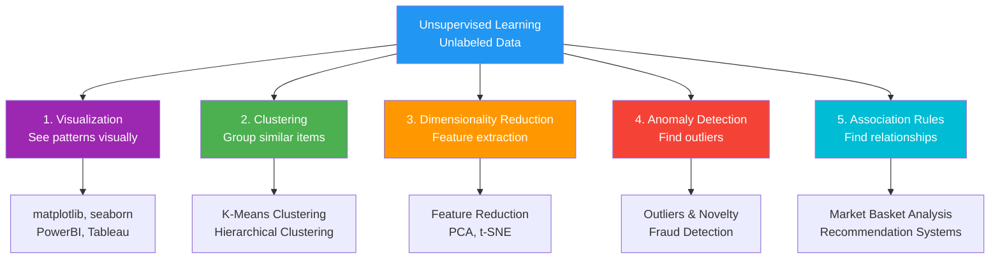
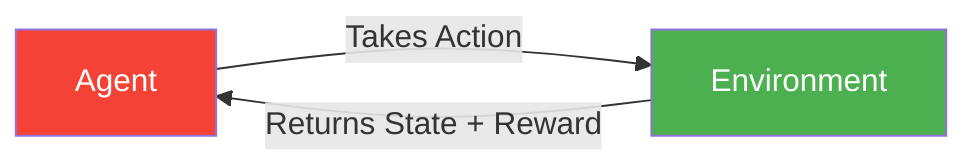

> *Think of machine learning like different teaching methods: some students need step-by-step guidance (supervised), others discover patterns themselves (unsupervised), while some learn by trying and getting feedback (reinforcement).*

---

## Overview

Machine learning can be categorized by **how much supervision** the algorithm needs during training:

---

## 1. [[2. Supervised Machine Learning|Supervised Machine Learning]]

**Analogy:** *Like learning math with an answer key - you see the problem AND the solution.*

- **Data:** Input features + Output labels
- **Goal:** Learn the mapping from inputs to outputs
- **Types:** [[2. Supervised Machine Learning#Regression|Regression]], [[2. Supervised Machine Learning#Classification|Classification]]

**Example Dataset:**
| IQ  | CGPA | Placement |
| --- | ---- | --------- |
| 85  | 8.9  | Yes       |
| 90  | 8.0  | Yes       |
| 75  | 6.0  | No        |

---

## 2. [[3. Unsupervised Machine Learning|Unsupervised Machine Learning]]

**Analogy:** *Like organizing your closet without labels - you group similar items (colors, types) naturally.*

- **Data:** Only input features (no labels)
- **Goal:** Discover hidden patterns or structure

### Types of Unsupervised Learning

**Examples:**
- Customer segmentation (clustering)
- Fraud detection (anomaly detection)
- "Customers who bought X also bought Y" (association rules)

---

## 3. [[4. Semi-Supervised Machine Learning|Semi-Supervised Machine Learning]]

**Analogy:** *Like learning from a few textbook examples, then practicing with unlabeled problems.*

- **Data:** Small amount of labeled + Large amount of unlabeled
- **Use Case:** Labeling data is expensive/time-consuming
- **Example:** You have 100 labeled medical images but 10,000 unlabeled ones

---

## 4. Self-Supervised Learning

**Analogy:** *Like learning a language by predicting the next word in a sentence - you create your own exercises from raw text.*

- **Data:** Unlabeled data that creates its own labels
- **Examples:** 
  - Predict next word in sentence
  - Predict masked portions of images
  - Predict image rotation angle

---

## 5. Reinforcement Learning

**Analogy:** *Like training a dog - reward good behavior (sit = treat), penalize bad behavior (bark = no treat).*

- **Components:** Agent, Environment, Actions, Rewards/Penalties
- **Goal:** Maximize cumulative reward
- **Examples:** Game AI, robotics, self-driving cars

---

## Quick Comparison

| Type | Supervision | Use Case |
|------|-------------|----------|
| **Supervised** | Full labels | Prediction with known outcomes |
| **Unsupervised** | No labels | Pattern discovery |
| **Semi-Supervised** | Few labels | Limited labeled data |
| **Self-Supervised** | Auto-generated | Learn from structure |
| **Reinforcement** | Rewards/Penalties | Sequential decision-making |

---

## Related Notes

- [[0. Machine Learning Terms]]
- [[2. Supervised Machine Learning]] - Detailed breakdown of regression and classification
- [[3. Unsupervised Machine Learning]] - Detailed breakdown of clustering, dimensionality reduction, and more
- [[4. Semi-Supervised Machine Learning]]
- [[Deep Learning vs Machine Learning]]

---

#machine-learning #ai #data-science