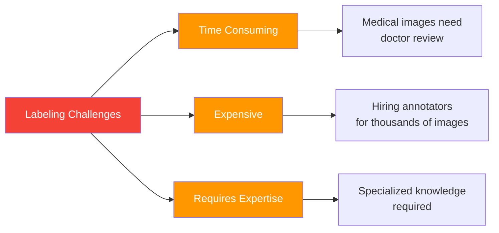
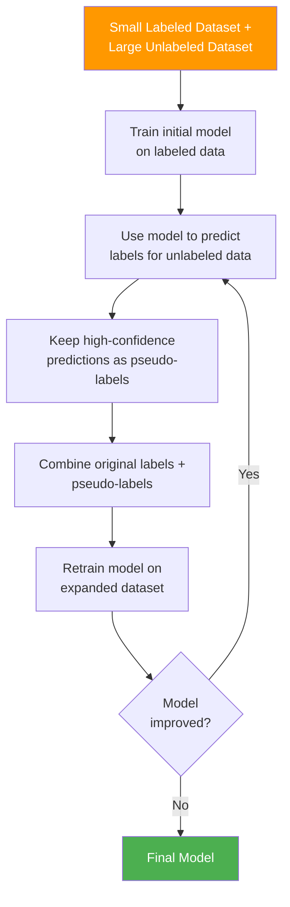
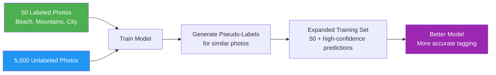
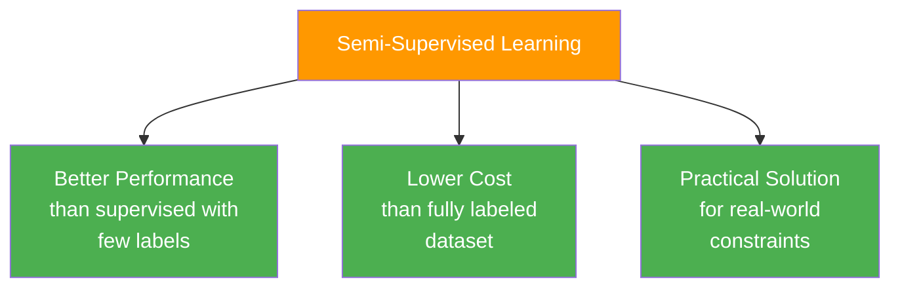
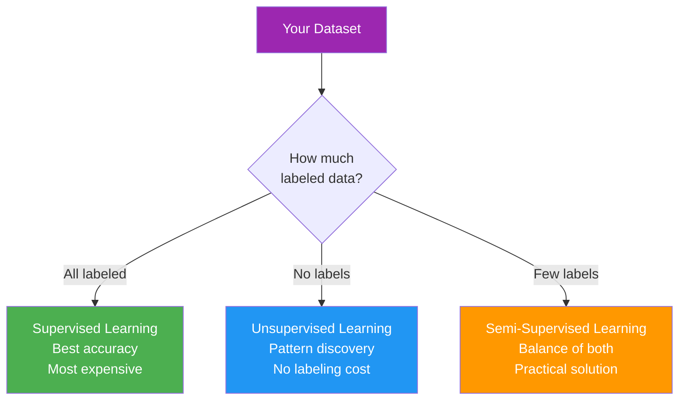

> *Like learning from a few textbook examples, then practicing with unlabeled problems.*

**Parent Note:** [[1. Types of Machine Learning]]

---

## What is Semi-Supervised Learning?

Semi-supervised learning uses a **combination of labeled and unlabeled data** during training. Typically, you have a small amount of labeled data and a large amount of unlabeled data.

**Analogy:** *Like learning a new language with a pocket dictionary (limited labeled examples) while being immersed in a foreign country (abundant unlabeled exposure).*

### Data Structure

**Partially Labeled Dataset:**

| Image | Features | **Label** |
| ----- | -------- | --------- |
| img_1 | [...]    | Cat       |
| img_2 | [...]    | Dog       |
| img_3 | [...]    | ?         |
| img_4 | [...]    | ?         |
| img_5 | [...]    | ?         |
| img_6 | [...]    | Cat       |
| img_7 | [...]    | ?         |

Notice: Only **some rows have labels**, while most remain unlabeled.

---

## Why Semi-Supervised Learning?

### The Labeling Problem

**Analogy:** *Like having thousands of photos but only having time to organize a handful into albums.*

### Common Scenarios

- **Few labeled examples:** 100 labeled images
- **Many unlabeled examples:** 10,000 unlabeled images
- **Solution:** Use both to train a better model

---

## How Semi-Supervised Learning Works

### Process

1. Start with small labeled dataset and large unlabeled dataset
2. Train initial model using only labeled data
3. Use model to predict labels for unlabeled data
4. Keep high-confidence predictions as "pseudo-labels"
5. Combine original labels with pseudo-labels
6. Retrain model on expanded dataset
7. Repeat until model performance stabilizes

---

## Real-World Example: Google Photos

**Analogy:** *Like organizing your photo library where you've tagged a few vacation photos, and Google suggests tags for the rest.*

### The Process

**Initial State:**
- You manually label 50 photos: "Beach," "Mountains," "City"
- You have 5,000 unlabeled photos

**Semi-Supervised Approach:**

**How Google Photos Uses This:**
1. You tag a few faces as "Mom," "Dad," "Sister"
2. Google finds similar faces in unlabeled photos
3. High-confidence matches become training data
4. Model improves and suggests more accurate tags
5. You confirm or correct suggestions
6. Model continues learning

---

## Image Classification Example

### Problem

You need to classify images of animals but:
- Labeling 10,000 images manually would take weeks
- You can only afford to label 200 images
- You want better accuracy than supervised learning with just 200 examples

### Solution: Semi-Supervised Learning

**Dataset:**
- 200 labeled images (cats, dogs, birds)
- 9,800 unlabeled images

**Approach:**

| Step | Action | Result |
|------|--------|--------|
| 1 | Train on 200 labeled images | Basic model (70% accuracy) |
| 2 | Predict on 9,800 unlabeled images | Generate pseudo-labels |
| 3 | Keep confident predictions (>90% confidence) | Add 3,000 pseudo-labeled images |
| 4 | Retrain on 200 + 3,000 images | Improved model (85% accuracy) |
| 5 | Repeat process | Final model (90% accuracy) |

---

## Advantages of Semi-Supervised Learning

### Key Benefits

1. **Cost-Effective:** Reduces labeling costs significantly
2. **Better Than Supervised Alone:** Performs better than using only the small labeled set
3. **Practical:** Addresses real-world constraint of limited labeled data
4. **Scalable:** Can leverage vast amounts of unlabeled data

---

## When to Use Semi-Supervised Learning

### Ideal Scenarios

**Use semi-supervised learning when:**
- Labeled data is expensive or time-consuming to obtain
- You have abundant unlabeled data
- Expert knowledge is required for labeling
- Labeling requires manual human effort

### Real-World Applications

| Domain | Scenario | Labeled | Unlabeled |
|--------|----------|---------|-----------|
| **Medical Imaging** | X-ray diagnosis | 100 doctor-reviewed | 10,000 scans |
| **Speech Recognition** | Voice commands | 500 transcribed | 50,000 audio clips |
| **Text Classification** | Document categorization | 200 manually tagged | 20,000 documents |
| **Fraud Detection** | Transaction analysis | 1,000 confirmed frauds | 1M transactions |
| **Social Media** | Content moderation | 500 reviewed posts | 100,000 posts |

---

## Comparison with Other Learning Types

| Aspect | Supervised | Semi-Supervised | Unsupervised |
|--------|------------|-----------------|--------------|
| **Labeled Data** | 100% | 5-20% | 0% |
| **Cost** | High | Medium | Low |
| **Accuracy** | Highest | High | Varies |
| **Use Case** | Known outcomes | Limited labels | Pattern discovery |

---

## Quick Summary

**Semi-supervised learning is the middle ground:**
- Uses **both labeled and unlabeled data**
- Practical when **labeling is expensive**
- Common in **image classification, NLP, medical imaging**
- Leverages **abundant unlabeled data** to improve model

**Remember:** It's about making the most of limited labeled data by learning from the abundance of unlabeled examples.

---

## Related Notes

- [[0. Machine Learning Terms]]
- [[1. Types of Machine Learning]] - Overview of all ML types
- [[2. Supervised Machine Learning]]
- [[3. Unsupervised Machine Learning]]
- [[5. Self-Supervised Machine Learning]]
---

#semi-supervised-learning #machine-learning #image-classification #pseudo-labeling #ai