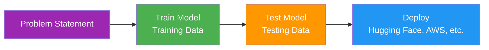
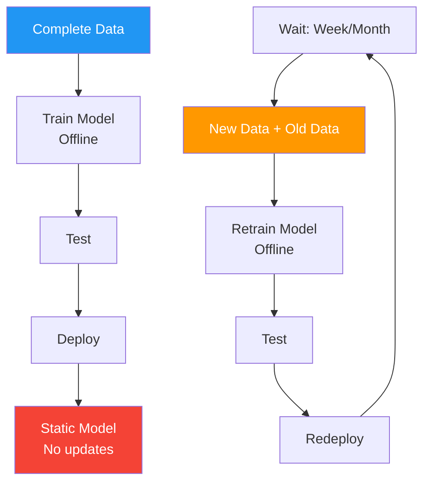
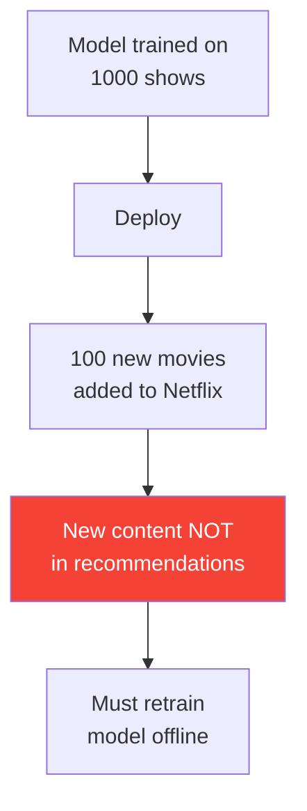
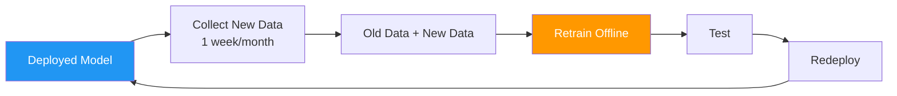
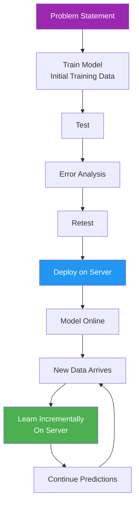
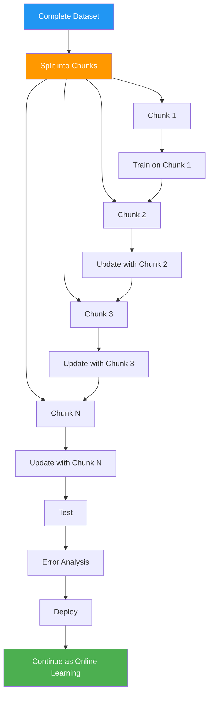
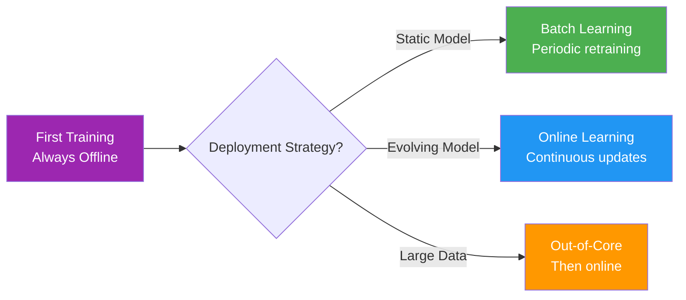

> *How does a model continue learning after deployment?*

**Parent Note:** [[1. Types of Machine Learning]]

---

## Classification Based on Deployment

Machine learning models can be classified based on **how they handle new data** during and after deployment:

1. **Batch Learning** (Offline Learning)
2. **Online Learning** (Incremental Learning)
3. **Out-of-Core Learning**

---

## Standard ML Pipeline

---

## 1. Batch Learning (Offline Learning)

**Definition:** Train the model with the **entire dataset at once**, then deploy. Model remains **static** after deployment.

**Analogy:** *Like printing a textbook - once published, it doesn't update until the next edition.*

### The Process

### Characteristics

- **Training:** Offline (on local system/server)
- **Data:** Entire dataset at once
- **Updates:** Periodic retraining required
- **Model State:** Static between updates
- **Evolution:** Not possible without retraining

### Problem: Static Model

**Example:** Netflix Recommendation System

**Issue:** New movies won't appear in recommendations until model is retrained with updated data.

### The Retraining Cycle

### When to Use

- Data is **not volatile** (changes slowly)
- Updates can happen periodically
- Examples: House price prediction, annual sales forecasting

### Pros & Cons

| Pros | Cons |
|------|------|
| Simple to implement | Model becomes outdated |
| Stable predictions | Cannot adapt to new patterns |
| Controlled updates | Requires periodic retraining |
| | Manual intervention needed |

---

## 2. Online Learning (Incremental Learning)

**Definition:** Model **continues learning** after deployment. New data is fed incrementally to update the model in real-time.

**Analogy:** *Like Wikipedia - constantly updated as new information becomes available.*

### The Process

### Characteristics

- **Training:** Online (on deployment server)
- **Data:** Incremental, continuous stream
- **Updates:** Real-time, automatic
- **Model State:** Continuously evolving
- **Evolution:** Happens automatically

### Key Difference

**Batch Learning:**
- Model taken **offline** for retraining
- Old data + New data merged
- Retrain completely
- Redeploy

**Online Learning:**
- Model stays **online** (never offline)
- New data fed directly to deployed model
- Learning happens on the server
- Predictions and learning happen simultaneously

### When to Use

- Data is **volatile** (changes frequently)
- Real-time adaptation needed
- Examples: Stock trading, social media feeds, recommendation systems

### Pros & Cons

| Pros | Cons |
|------|------|
| Real-time adaptation | Complex to implement |
| No downtime | Risk of learning bad patterns |
| Evolves with data | Requires monitoring |
| Automatic updates | Higher computational cost |

---

## 3. Out-of-Core Learning

**Definition:** Divide complete data into **chunks**, train model incrementally on each chunk. Combines aspects of batch and online learning.

**Analogy:** *Like eating a large pizza slice by slice instead of all at once.*

### The Problem with Complete Data

- Memory limitations
- Long training times
- Computational constraints
- Difficult to manage large datasets

### The Solution: Chunking

### Characteristics

- **Training:** Incremental chunks (offline initially)
- **Data:** Divided into manageable pieces
- **Updates:** After deployment, follows online learning
- **Model State:** Evolves with each chunk
- **Complexity:** Higher than batch or online alone

### When to Use

- Dataset too large for memory
- Limited computational resources
- Need incremental learning with large data
- Examples: Training on terabytes of data, big data applications

### Pros & Cons

| Pros | Cons |
|------|------|
| Handles massive datasets | More complex implementation |
| Memory efficient | Risk of order-dependent learning |
| Scalable | Requires careful chunk management |
| | Model trained on multiple instances |

---

## Comparison Table

| Aspect | Batch Learning | Online Learning | Out-of-Core Learning |
|--------|----------------|-----------------|---------------------|
| **Training Location** | Offline (local system) | Online (deployment server) | Offline chunks → Online |
| **Data Handling** | Complete data at once | Incremental stream | Chunks, then stream |
| **Model Updates** | Periodic (manual) | Continuous (automatic) | Chunked → Continuous |
| **Downtime** | Yes (during retraining) | No | Initially yes, then no |
| **Complexity** | Low | Medium | High |
| **Memory Usage** | High | Low-Medium | Low |
| **Adaptability** | Low (static) | High (evolving) | Medium-High |
| **Risk Level** | Low | Medium | High |

---

## Real-World Examples

| Use Case | Batch Learning | Online Learning | Out-of-Core Learning |
|----------|----------------|-----------------|---------------------|
| **Example** | House price prediction | Stock trading algorithm | Training GPT on internet data |
| **Data Pattern** | Yearly updates | Real-time prices | Massive text corpus |
| **Update Frequency** | Monthly/Yearly | Every transaction | Chunks → Real-time |
| **Why This Approach?** | Prices stable, periodic updates OK | Prices volatile, need instant adaptation | Too much data for memory, then needs updates |

### Detailed Examples

**Batch Learning - House Price Prediction:**
- Train on last year's housing data
- Deploy model
- Use for 6 months
- Retrain with new 6 months data
- Redeploy

**Online Learning - Stock Trading:**
- Initial training on historical data (offline)
- Deploy to server
- Each new trade updates the model
- Model adapts to market changes in real-time
- Never goes offline

**Out-of-Core Learning - Language Model:**
- 100 TB of internet text data
- Split into 1000 chunks of 100 GB each
- Train on Chunk 1
- Update with Chunk 2
- Continue through all chunks
- Deploy and switch to online learning

---

## Key Insight: First Training

**Important:** The **first time a model is trained** is **always offline** (batch learning).

After initial training, you choose:
- **Batch:** Keep offline, retrain periodically
- **Online:** Deploy and continue learning on server
- **Out-of-Core:** Train in chunks, then deploy for online learning

---

## Quick Decision Guide

**Choose Batch Learning when:**
- Data changes slowly
- Periodic updates are acceptable
- Stability is more important than adaptability

**Choose Online Learning when:**
- Data is highly dynamic
- Real-time adaptation is critical
- Model must evolve continuously

**Choose Out-of-Core Learning when:**
- Dataset is too large for memory
- Need incremental training initially
- Plan to switch to online learning after deployment

---

## Related Notes

- [[0. Machine Learning Terms]]
- [[1. Types of Machine Learning]]

---

#batch-learning #online-learning #incremental-learning #model-deployment #mlops