# Instance-Based vs Model-Based Learning

> *Memorizing vs Understanding: Two fundamentally different ways machines learn.*

**Parent Note:** [[1. Types of Machine Learning]]

---

## Classification Based on How Models Work

Machine learning can be categorized by **how predictions are made**:

1. **Instance-Based Learning** - Memorize and compare
2. **Model-Based Learning** - Generalize and apply patterns

---

## 1. Instance-Based Learning / Lazy Learning

**Definition:** Prediction is based on **similarity** to training data. The model **memorizes** all training examples and compares new data to them.

**Analogy:** *Like studying for an exam by memorizing past questions - when you see a new question, you find the most similar past question and use its answer.*

![[Pasted image 20260127170249.png]]

### How It Works

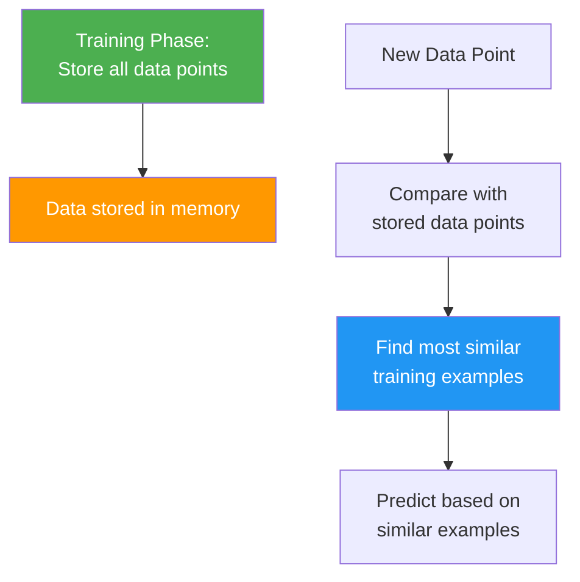

### Key Characteristic: No Actual Model

**There is no generalized pattern or formula.** The algorithm simply:
1. Stores all training data
2. When prediction needed, finds similar examples
3. Uses those similar examples to predict

### Example: Student Placement Prediction

**Training Data:**

| IQ  | CGPA | Study Hours | **Placement** |
| --- | ---- | ----------- | ------------- |
| 85  | 8.9  | 6           | Yes           |
| 90  | 8.0  | 5           | Yes           |
| 75  | 6.0  | 3           | No            |
| 88  | 8.5  | 7           | Yes           |
| 70  | 5.5  | 2           | No            |

**New Student:**
- IQ: 87, CGPA: 8.2, Study Hours: 6

**Prediction Process:**

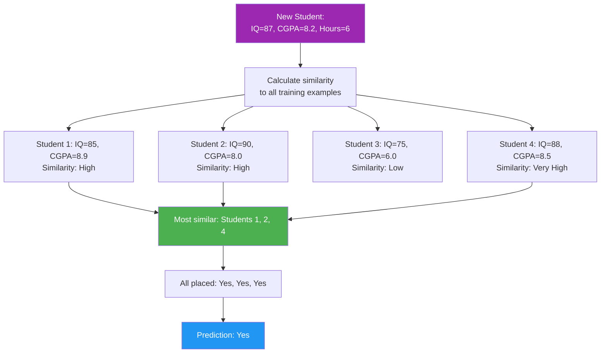

**No formula learned** - just compared to memorized examples!

### Deployment Requirement

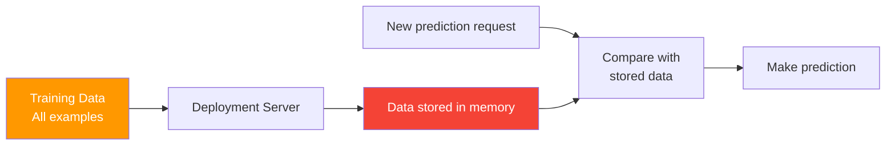

**Critical:** The **entire training dataset** must be sent to the server and kept in memory during deployment.

### Common Algorithms

- **K-Nearest Neighbors (KNN)** - Classification/Regression
- **K-Means Clustering** - Unsupervised learning
- **Case-Based Reasoning**

### Pros & Cons

| Pros | Cons |
|------|------|
| Simple to understand | Requires all data at deployment |
| No training time needed | High memory requirements |
| Adapts to new data easily | Slow predictions (compares to all data) |
| Works well with irregular patterns | Doesn't scale well with large datasets |

---

## 2. Model-Based Learning

**Definition:** Learn a **generalized pattern or formula** from training data. The model recognizes patterns and creates rules, not memorizing individual examples.

**Analogy:** *Like understanding the concept of addition - once you learn the pattern (2+2=4, 3+3=6), you can solve any addition problem without memorizing every possible combination.*

![[Pasted image 20260127170336.png]]

### How It Works

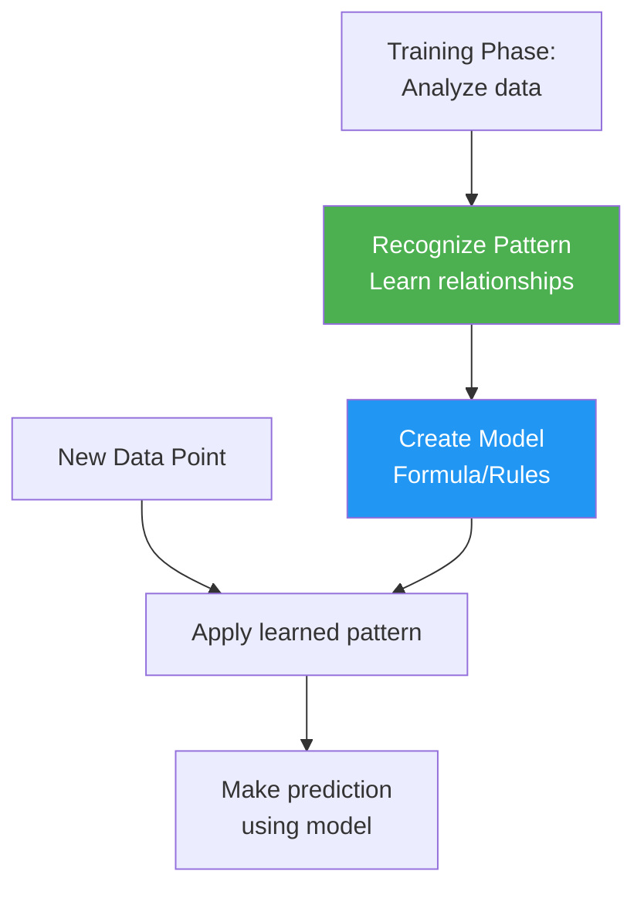

### Key Characteristic: Generalization

**A pattern is learned and remembered.** The algorithm:
1. Analyzes training data
2. Finds underlying patterns/relationships
3. Creates a mathematical model or decision boundary
4. Uses that model for all future predictions

### Example: Linear Regression for Placement

**Training Data:**

| Study Hours (x) | **CGPA (y)** |
| --------------- | ------------ |
| 2               | 6.0          |
| 4               | 7.0          |
| 6               | 8.0          |
| 8               | 9.0          |

**Pattern Recognition:**

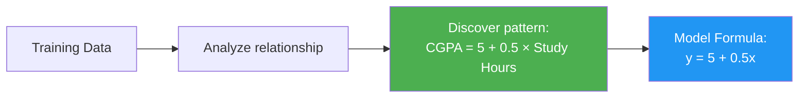

**Learned Formula:** `CGPA = 5 + 0.5 × Study Hours`

**New Student:**
- Study Hours: 7

**Prediction:**
```
CGPA = 5 + 0.5 × 7
CGPA = 5 + 3.5
CGPA = 8.5
```

**No data comparison needed** - just apply the formula!

### Visualization: Decision Boundary

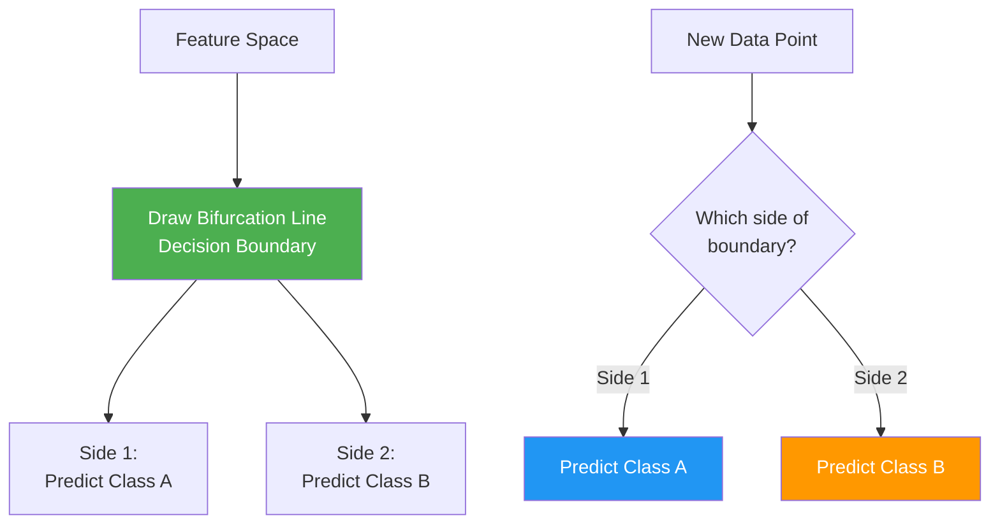

### Deployment Requirement

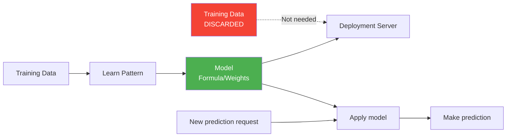

**Critical:** Only the **model (formula/weights)** is sent to the server. **Training data is NOT needed** during deployment.

### Common Algorithms

- **Linear Regression**
- **Logistic Regression**
- **Support Vector Machines (SVM)**
- **Decision Trees**
- **Neural Networks**
- **All types of regression models**

### Pros & Cons

| Pros | Cons |
|------|------|
| Fast predictions | Training time required |
| Low memory at deployment | May miss complex local patterns |
| Scalable to large datasets | Can overfit or underfit |
| Only model needed (not data) | Requires retraining for new patterns |

---

## Key Differences

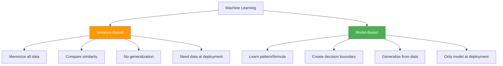

### Comparison Table

| Aspect | Instance-Based | Model-Based |
|--------|----------------|-------------|
| **Learning Approach** | Memorization | Generalization |
| **Training** | Store all data | Learn pattern/formula |
| **Prediction Method** | Find similar examples | Apply learned pattern |
| **Data at Deployment** | Required (all training data) | Not required |
| **Memory Usage** | High | Low |
| **Prediction Speed** | Slow (compares to all data) | Fast (apply formula) |
| **Scalability** | Poor with large datasets | Good |
| **Pattern Recognition** | No explicit pattern | Explicit pattern/formula |
| **Examples** | KNN, K-Means | Linear Regression, SVM, Decision Trees |

---

## Visual Comparison: Student Placement

### Instance-Based Approach

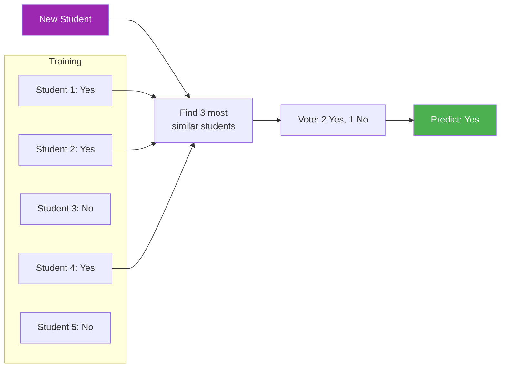

**Needs all 5 students' data at deployment**

### Model-Based Approach

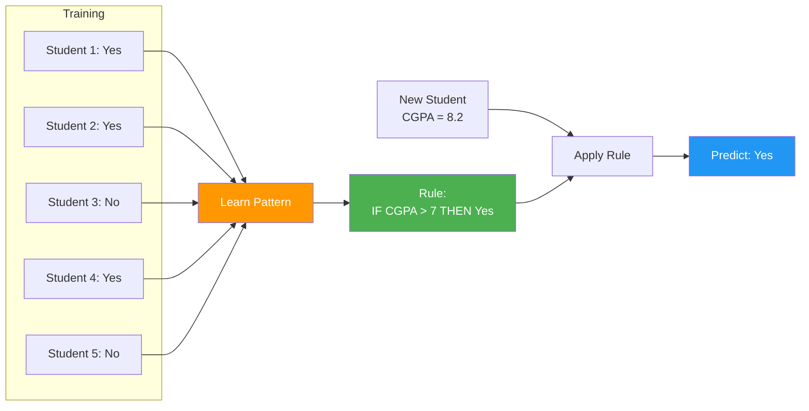

**Only needs the rule at deployment, not the 5 students' data**

---

## Real-World Examples

### Instance-Based: Product Recommendation

**System:** Netflix movie recommendations using collaborative filtering

**Process:**
1. Store all user viewing histories
2. New user watches movies A, B, C
3. Find users with similar viewing patterns
4. Recommend what those similar users watched
5. **Requires:** All user data stored and accessible

### Model-Based: House Price Prediction

**System:** Predicting house prices

**Process:**
1. Train on historical sales data
2. Learn formula: `Price = 50000 + 200×sqft + 30000×bedrooms`
3. New house: 1500 sqft, 3 bedrooms
4. Predict: `Price = 50000 + 200×1500 + 30000×3 = $440,000`
5. **Requires:** Only the formula, not historical data

---

## When to Use Each?

### Use Instance-Based When:

- Data has irregular, complex patterns
- Examples naturally cluster
- Personalization is key
- Dataset is small to medium
- Real-time updates to training data needed

**Example:** Recommendation systems, anomaly detection

### Use Model-Based When:

- Clear patterns exist in data
- Need fast predictions
- Large dataset
- Memory constraints at deployment
- Generalization is more important than specifics

**Example:** Regression, classification with clear boundaries

---

## Deployment Architecture

### Instance-Based Deployment

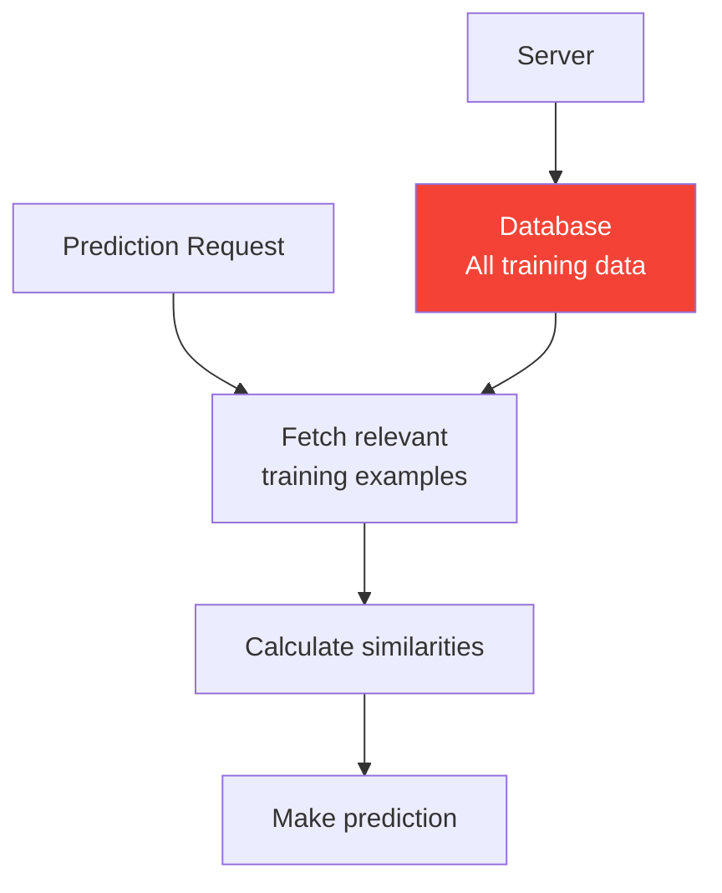

**Challenge:** High memory and storage requirements

### Model-Based Deployment

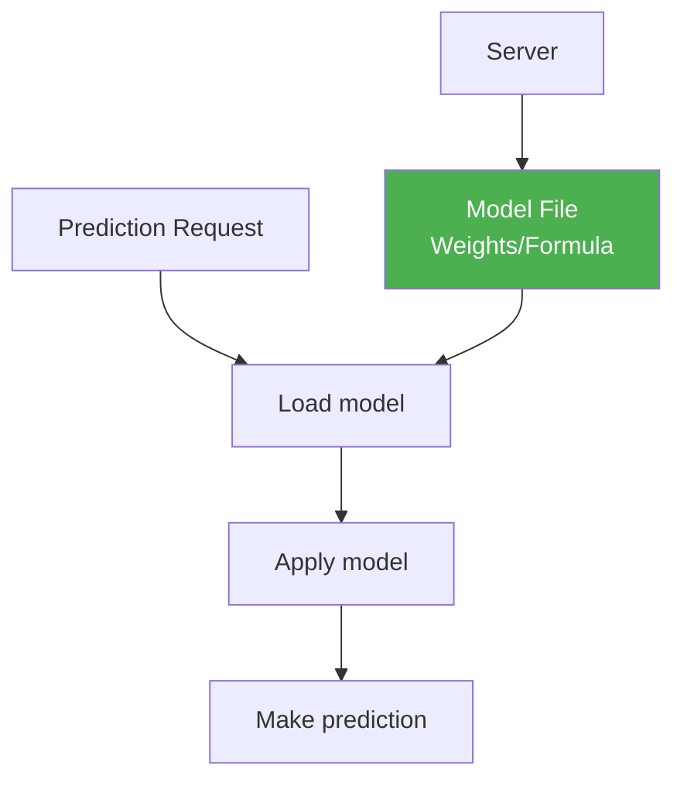

**Advantage:** Lightweight, fast, scalable

---

## Quick Summary

**Instance-Based Learning:**
- **Memorizes** all training data
- Predicts by **finding similar examples**
- Needs **data at deployment**
- Examples: KNN, K-Means
- Analogy: Memorizing exam answers

**Model-Based Learning:**
- **Generalizes** patterns from data
- Predicts by **applying learned rules**
- Only needs **model at deployment**
- Examples: Linear Regression, SVM, Neural Networks
- Analogy: Understanding concepts

**Key Difference:** Memory vs Understanding

---

## Related Notes

- [[0. Machine Learning Terms]]
- [[1. Types of Machine Learning]]
---

#instance-based-learning #model-based-learning #machine-learning #knn #regression #deployment