> *Like learning a language by predicting the next word in a sentence - you create your own exercises from raw text.*

**Parent Note:** [[1. Types of Machine Learning]]

---

## What is Self-Supervised Learning?

Self-supervised learning **generates labeled data from unlabeled data** automatically. The model creates its own supervision signal by designing tasks where the labels come directly from the data itself.

**Analogy:** *Like doing a jigsaw puzzle - you don't need someone to tell you which pieces go together; the pieces themselves show you through their shapes and patterns.*

### Key Concept

**We transform unlabeled data into a supervised learning problem by:**
- Hiding part of the data
- Making the model predict the hidden part
- The hidden part becomes the label

---

## How Self-Supervised Learning Works


### The Process

1. Take unlabeled data
2. Design a pretext task that creates labels automatically
3. Train model on this self-created task
4. Model learns useful representations
5. Fine-tune for actual task

---

## Example 1: Predicting Next Word

**Analogy:** *Like completing sentences in your head while reading - you naturally predict what comes next.*

### The Task

**Given:** "The cat sat on the ___"

**Unlabeled Data:**
```
The cat sat on the mat.
```

**Self-Created Labels:**

| Input (Context) | Label (Next Word) |
|----------------|-------------------|
| "The" | "cat" |
| "The cat" | "sat" |
| "The cat sat" | "on" |
| "The cat sat on" | "the" |
| "The cat sat on the" | "mat" |

**Process:**


**Result:** Model learns language patterns, grammar, and context without any manual labeling.

---

## Example 2: Image Rotation Prediction

**Analogy:** *Like learning what "right-side up" looks like by seeing objects in different orientations.*

### The Task

Take an image and rotate it by 0°, 90°, 180°, or 270°. The model must predict the rotation angle.

**Original Unlabeled Image:**
```
🏠 (House image)
```

**Self-Created Dataset:**

| Rotated Image | Auto-Generated Label |
|---------------|---------------------|
| 🏠 (0°) | 0 |
| 🏚️ (90°) | 90 |
| 🏠 (180°) | 180 |
| 🏚️ (270°) | 270 |

```mermaid
graph TD
    IMG[Unlabeled Image] --> ROT[Apply Rotations<br/>0°, 90°, 180°, 270°]
    ROT --> AUTO[Auto-Generated Labels:<br/>Rotation Angle]
    AUTO --> TRAIN[Train Model to<br/>Predict Rotation]
    TRAIN --> LEARN[Model Learns<br/>Object Structure & Orientation]
    
    style IMG fill:#2196F3,color:#fff
    style AUTO fill:#FF9800,color:#fff
    style LEARN fill:#4CAF50,color:#fff
```



**What the Model Learns:**
- Object shapes and boundaries
- Spatial relationships
- Visual features
- Orientation awareness

---

## Example 3: Masked Image Modeling

**Analogy:** *Like looking at a photo with some parts covered and guessing what's hidden.*

### The Task

Hide parts of an image and make the model predict what's missing.

**Process:**


**Example:**
- Original: Full image of a cat on a sofa
- Masked: 25% of image patches are hidden
- Task: Predict the pixel values of hidden patches
- Label: The actual pixel values (from original image)

---

## Example 4: Contrastive Learning

**Analogy:** *Like learning to recognize your friend by seeing many photos of them in different settings and learning what stays the same.*

### The Task

Create multiple views of the same image and teach the model that they represent the same thing.


**Self-Created Labels:**
- Augmented versions of same image: Label = "Similar"
- Different images: Label = "Dissimilar"

---

## Common Self-Supervised Tasks


### Task Categories

| Domain | Task | Input | Auto-Generated Label |
|--------|------|-------|---------------------|
| **Text** | Next word prediction | "The cat sat on" | "the" |
| **Text** | Masked word | "The [MASK] sat" | "cat" |
| **Image** | Rotation | Rotated image | Rotation angle (0°, 90°, 180°, 270°) |
| **Image** | Jigsaw | Shuffled patches | Correct patch order |
| **Image** | Colorization | Grayscale image | Original colors |
| **Video** | Frame order | Shuffled frames | Correct sequence |
| **Audio** | Masked audio | Audio with gaps | Missing audio segment |

---

## Self-Supervised vs Semi-Supervised

**Key Difference:** How labels are obtained


| Aspect | Semi-Supervised | Self-Supervised |
|--------|----------------|-----------------|
| **Human Labels** | Few needed initially | None needed |
| **Label Source** | Human + pseudo-labels | Data structure itself |
| **Example** | 100 labeled + 10K unlabeled images | Predict rotation of images |
| **Analogy** | Learn from few examples + practice | Create your own practice problems |
| **Cost** | Medium (some labeling) | Very low (no labeling) |

---

## Real-World Applications

### 1. Language Models (GPT, BERT)

**Task:** Predict next word / masked word
**Data:** Massive text from internet (unlabeled)
**Result:** Models that understand language

### 2. Computer Vision (SimCLR, MoCo)

**Task:** Contrastive learning on images
**Data:** Millions of unlabeled images
**Result:** Models that understand visual features

### 3. Speech Recognition

**Task:** Predict masked audio segments
**Data:** Unlabeled audio recordings
**Result:** Models that understand speech patterns

---

## Why Self-Supervised Learning is Powerful


### Key Advantages

1. **Scalability:** Can use unlimited unlabeled data
2. **Cost-Effective:** No expensive human labeling
3. **Generalization:** Learns broadly useful features
4. **Transfer Learning:** Pre-trained models work on many tasks

---

## The Big Picture


---

## Quick Summary

**Self-supervised learning:**
- Generates labels **automatically from unlabeled data**
- Creates **pretext tasks** (rotation, masking, prediction)
- No human labeling required
- Powers modern AI (GPT, BERT, image models)
- Enables learning from massive datasets

**Remember:** The data provides its own supervision through clever task design.

---

## Related Notes

- [[0. Machine Learning Terms]]
- [[1. Types of Machine Learning]] - Overview of all ML types
- [[2. Supervised Machine Learning]]
- [[3. Unsupervised Machine Learning]]
- [[4. Semi-Supervised Machine Learning]]

---

#self-supervised-learning #machine-learning #pretext-tasks #representation-learning #ai

