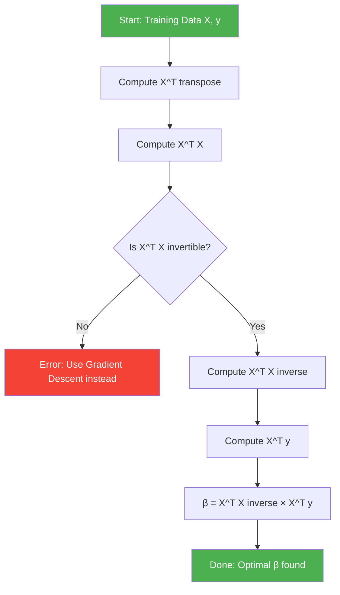
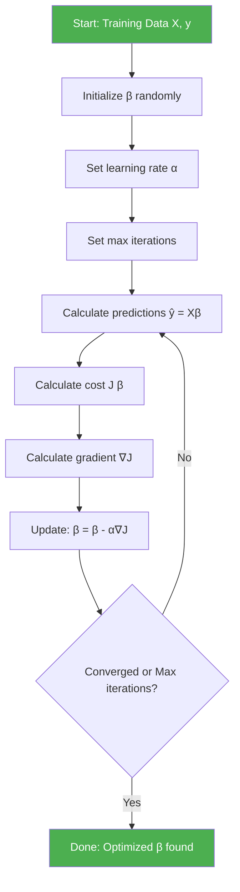
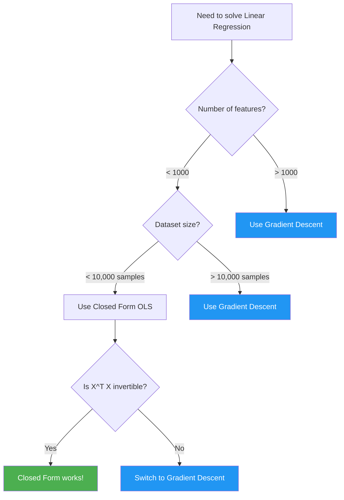

## Overview

To find optimal coefficients (β₀, β₁, ..., βₙ) in linear regression, we have two main approaches:

1. **Closed Form Solution** (Analytical)
2. **Gradient Descent** (Iterative)

---

## Closed Form Solution (Normal Equation)

### Definition

**Closed form** means we can calculate the exact solution using a **direct formula** without iteration.

Also called:
- **Ordinary Least Squares (OLS)**
- **Normal Equation**
- **Analytical Solution**

---

### Mathematical Formula

For simple linear regression (1 variable):

$$m = \frac{\sum_{i=1}^{n}(x_i - \bar{x})(y_i - \bar{y})}{\sum_{i=1}^{n}(x_i - \bar{x})^2}$$

$$c = \bar{y} - m\bar{x}$$

For multiple linear regression (matrix form):

$$\beta = (X^TX)^{-1}X^Ty$$

Where:
- **β** = vector of coefficients (including intercept)
- **X** = design matrix (input features)
- **y** = target vector
- **$X^T$** = transpose of X
- **$(X^TX)^{-1}$** = inverse of $X^TX$

---

### Time Complexity

**Computing matrix inverse:** $O(n^3)$

Where n = number of features

**Problem:** For large datasets with many features, this becomes computationally expensive!

**Example:**
- 10 features → $10^3 = 1,000$ operations
- 1,000 features → $1,000^3 = 1,000,000,000$ operations (1 billion!)

---

### Advantages

✅ **Exact solution** (no approximation)
✅ **One-step computation** (no iteration)
✅ **No hyperparameters** to tune (no learning rate)
✅ **Works well for small datasets** (< 10,000 features)

---

### Disadvantages

❌ **$O(n^3)$ time complexity** (very slow for many features)
❌ **Requires matrix inversion** (computationally expensive)
❌ **Needs entire dataset in memory**
❌ **Fails if $X^TX$ is singular** (non-invertible)
❌ **Doesn't scale to large datasets**

---

### When to Use Closed Form

Use when:
- Dataset is **small** (< 10,000 samples)
- Number of features is **small** (< 1,000)
- You need the **exact solution**
- Matrix $X^TX$ is **invertible**

---

## Gradient Descent (Non-Closed Form)

### Definition

**Gradient descent** is an **iterative optimization algorithm** that finds the minimum by taking steps proportional to the negative of the gradient.

**Key idea:** Start with random parameters, then repeatedly adjust them to reduce error.

---

### Algorithm Steps
```
1. Initialize parameters randomly: β = [random values]
2. Repeat until convergence:
   a. Calculate predictions: ŷ = Xβ
   b. Calculate error/loss: J(β) = MSE
   c. Calculate gradient: ∇J = partial derivatives
   d. Update parameters: β = β - α∇J
3. Return optimized β
```

---

### Mathematical Formulas

**Cost Function (MSE):**

$$J(\beta) = \frac{1}{2m}\sum_{i=1}^{m}(h_\beta(x^{(i)}) - y^{(i)})^2$$

**Gradient:**

$$\nabla J(\beta) = \frac{1}{m}X^T(X\beta - y)$$

**Update Rule:**

$$\beta_{new} = \beta_{old} - \alpha \nabla J(\beta_{old})$$

Where:
- **α** (alpha) = learning rate (step size)
- **m** = number of training examples
- **∇J** = gradient vector

---

### Time Complexity

**Per iteration:** $O(m \cdot n)$

Where:
- m = number of samples
- n = number of features

**Total:** $O(k \cdot m \cdot n)$

Where k = number of iterations

**Key advantage:** Linear in features (much better than $O(n^3)$!)

---

### Advantages

✅ **Scales to large datasets** (millions of samples)
✅ **Works with many features** (millions of features)
✅ **Memory efficient** (can use mini-batches)
✅ **Always works** (no matrix inversion needed)
✅ **Can be parallelized**
✅ **Works for non-linear models** too

---

### Disadvantages

❌ **Requires tuning learning rate** (α)
❌ **May converge slowly**
❌ **Can get stuck in local minima** (for non-convex functions)
❌ **Requires multiple iterations**
❌ **Approximate solution** (not exact)

---

### When to Use Gradient Descent

Use when:
- Dataset is **large** (> 10,000 samples)
- Number of features is **large** (> 1,000)
- $X^TX$ is **non-invertible**
- Need **memory efficiency**
- Working with **online learning** (streaming data)

---

## Flowchart Comparison

### Closed Form Solution Flowchart


---

### Gradient Descent Flowchart


---

## Side-by-Side Comparison

| Aspect | Closed Form (OLS) | Gradient Descent |
|--------|-------------------|------------------|
| **Type** | Analytical | Iterative |
| **Iterations** | One-step | Multiple |
| **Time Complexity** | $O(n^3)$ | $O(k \cdot m \cdot n)$ |
| **Speed (small data)** | ✅ Fast | Slower |
| **Speed (large data)** | ❌ Very slow | ✅ Fast |
| **Memory** | Needs full dataset | Can use batches |
| **Accuracy** | Exact | Approximate |
| **Hyperparameters** | None | Learning rate |
| **Scalability** | Poor | Excellent |
| **Works when $X^TX$ singular** | ❌ No | ✅ Yes |

---

## Decision Tree: Which Method to Use?


---

## Matrix Inversion Problem

### Why is Inversion $O(n^3)$?

Matrix inversion typically uses:
- **Gaussian elimination**
- **LU decomposition**
- **Cholesky decomposition**

All have $O(n^3)$ complexity for $n \times n$ matrix.

### Example: Computational Cost

| Features (n) | Operations ($n^3$) | Time (approx) |
|--------------|-------------------|---------------|
| 10 | 1,000 | < 1 ms |
| 100 | 1,000,000 | ~10 ms |
| 1,000 | 1,000,000,000 | ~10 seconds |
| 10,000 | $10^{12}$ | ~3 hours |
| 100,000 | $10^{15}$ | Impractical |

**Conclusion:** Closed form becomes impractical beyond ~10,000 features.

---

## Python Implementation

### Closed Form (Normal Equation)
```python
import numpy as np

def closed_form_solution(X, y):
    """
    Solve linear regression using Normal Equation
    β = (X^T X)^(-1) X^T y
    """
    # Add bias column (intercept)
    X_b = np.c_[np.ones((X.shape[0], 1)), X]
    
    # Normal equation
    beta = np.linalg.inv(X_b.T @ X_b) @ X_b.T @ y
    
    return beta

# Example
X = np.array([[1], [2], [3], [4]])
y = np.array([2, 4, 6, 8])

beta = closed_form_solution(X, y)
print(f"Coefficients: {beta}")
```

---

### Gradient Descent
```python
import numpy as np

def gradient_descent(X, y, learning_rate=0.01, iterations=1000):
    """
    Solve linear regression using Gradient Descent
    """
    # Add bias column
    X_b = np.c_[np.ones((X.shape[0], 1)), X]
    
    # Initialize parameters randomly
    beta = np.random.randn(X_b.shape[1])
    
    m = len(y)
    
    for i in range(iterations):
        # Predictions
        y_pred = X_b @ beta
        
        # Calculate gradient
        gradient = (1/m) * X_b.T @ (y_pred - y)
        
        # Update parameters
        beta = beta - learning_rate * gradient
        
        # Optional: print cost every 100 iterations
        if i % 100 == 0:
            cost = (1/(2*m)) * np.sum((y_pred - y)**2)
            print(f"Iteration {i}: Cost = {cost:.4f}")
    
    return beta

# Example
X = np.array([[1], [2], [3], [4]])
y = np.array([2, 4, 6, 8])

beta = gradient_descent(X, y, learning_rate=0.01, iterations=1000)
print(f"Coefficients: {beta}")
```

---

## Key Takeaways

1. **Closed Form (OLS):** Direct formula, $O(n^3)$, exact solution
2. **Gradient Descent:** Iterative, $O(k \cdot m \cdot n)$, approximate solution
3. **Use Closed Form** for small datasets (< 10k samples, < 1k features)
4. **Use Gradient Descent** for large datasets or many features
5. **Matrix inversion** is the bottleneck in closed form
6. **Gradient descent scales better** to large problems
7. **Linear regression cost function is convex** → guaranteed convergence

---

## Further Reading

**"Hands-On Machine Learning with Scikit-Learn, Keras, and TensorFlow" by Aurélien Géron:**
- Chapter 4: Training Models
  - Section: Linear Regression (Normal Equation)
  - Section: Gradient Descent
  - "The Normal Equation computes the inverse of $X^TX$, which is an $n \times n$ matrix (where n is the number of features). The computational complexity of inverting such a matrix is typically about $O(n^{2.4})$ to $O(n^3)$ depending on the implementation."

**"Pattern Recognition and Machine Learning" by Christopher Bishop:**
- Chapter 3: Linear Models for Regression
  - Section 3.1.1: Maximum likelihood and least squares
  - Discusses closed-form solution and its limitations

**"The Elements of Statistical Learning" by Hastie, Tibshirani, Friedman:**
- Chapter 3: Linear Methods for Regression
  - Section 3.2: Linear Regression Models and Least Squares
  - Detailed mathematical derivation of both approaches