# Challenges in Machine Learning

> *Even the best algorithms fail without good data and proper training.*

**Parent Note:** [[1. Types of Machine Learning]]

---

## Overview

Machine learning faces several fundamental challenges that can prevent models from performing well:

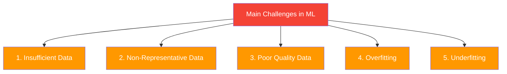

---

## 1. Insufficient Data

**Problem:** Not having enough training examples for the model to learn effectively.

**Analogy:** *Like trying to learn a language by reading just 10 sentences - you won't understand the full complexity.*

### The Core Issue

Gathering data is **hard**:
- Time-consuming and expensive
- Requires domain expertise
- Privacy and legal constraints
- Data labeling costs

### The Data-Variety Principle

**Key Insight:** The more **variety** of data we feed, the more our model improves.

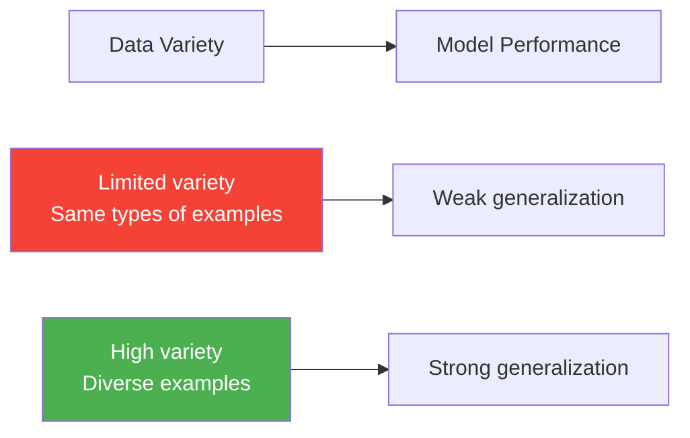

### The Trade-off: More Data vs Complex Model

**Critical Decision:**

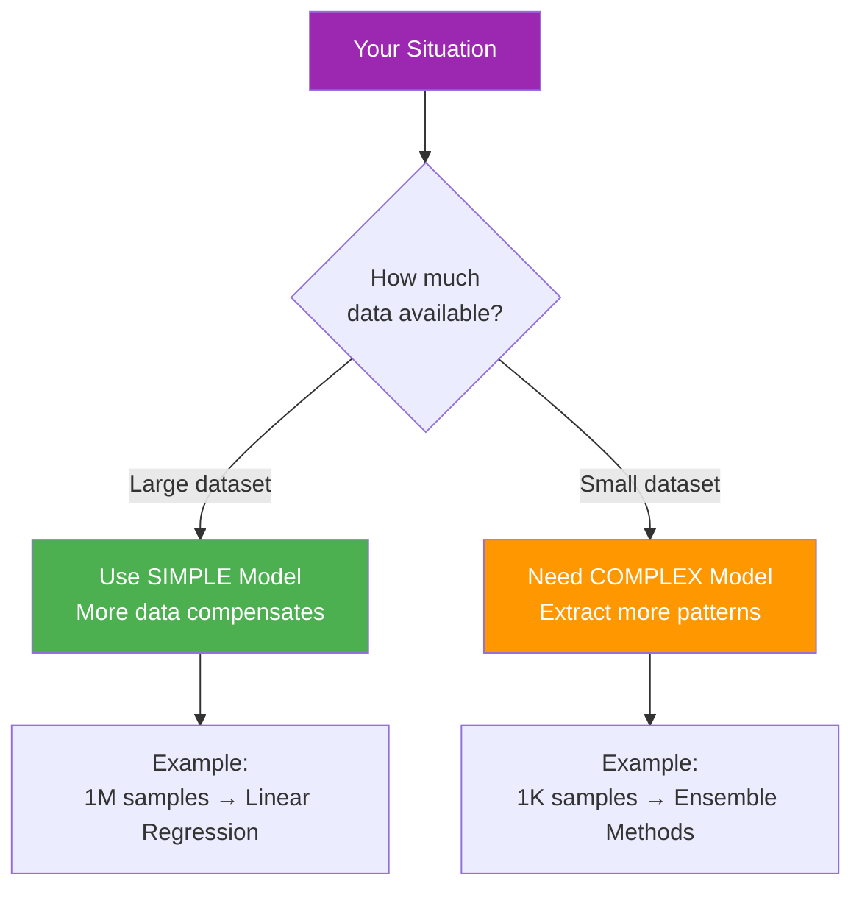

**Rule of Thumb:**

| Scenario | Recommended Approach |
|----------|---------------------|
| **More Data** → | Simple Model |
| **Less Data** → | Complex Model |

**Why?**
- **More data:** Patterns are clear, simple model can learn them
- **Less data:** Need sophisticated model to extract maximum information

### Example

**Scenario:** Image classification

| Data Available | Model Choice | Reasoning |
|----------------|--------------|-----------|
| 1 million images | Simple CNN | Data speaks for itself |
| 1,000 images | Complex architecture + data augmentation | Need to squeeze out every pattern |

---

## 2. Non-Representative Training Data

**Problem:** Training data doesn't accurately represent the real-world data the model will encounter in production.

**Analogy:** *Like learning to drive only in parking lots, then being surprised by highway traffic.*

### What is Representative Data?

**Representative data** reflects the true distribution of data the model will see in production.

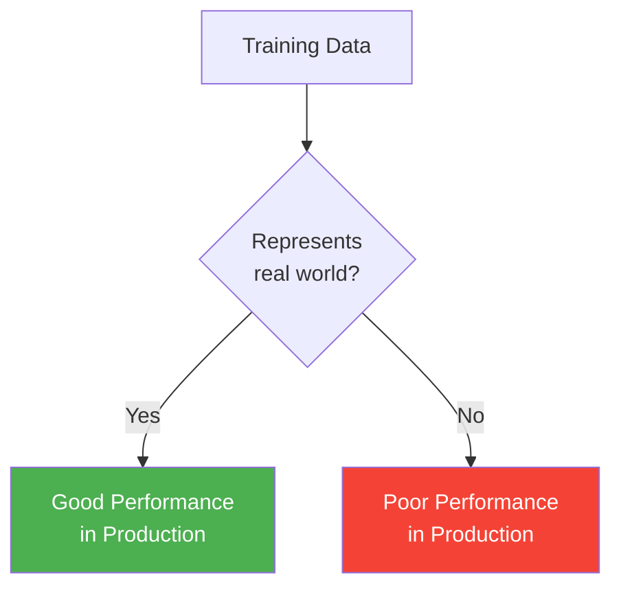

### Common Problems

#### Problem 1: Sampling Bias

**Definition:** Training data is biased towards certain groups or patterns.

**Example:** Medical diagnosis model

| Training Data | Issue | Real World Impact |
|---------------|-------|-------------------|
| 90% patients from urban hospitals | Underrepresents rural patients | Fails on rural patient data |
| Mostly young patients | Lacks elderly patient data | Poor predictions for elderly |

#### Problem 2: Limited Coverage

**Example:** Spam detection trained only on English emails fails on other languages.

#### Problem 3: Temporal Bias

**Example:** Model trained on 2020 data fails in 2024 because patterns changed.

### Visual Representation

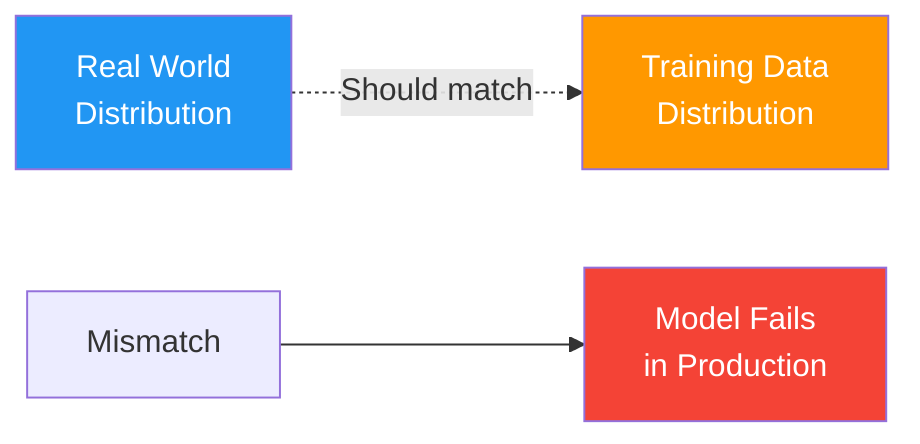

### Solutions

- Collect diverse, balanced data
- Use stratified sampling
- Regular data audits
- Continuous monitoring in production

---

## 3. Poor Quality of Data

**Problem:** Data contains errors, noise, outliers, or missing values that corrupt the learning process.

**Analogy:** *Like trying to learn from a textbook with torn pages, smudged text, and wrong answers.*

### Types of Data Quality Issues

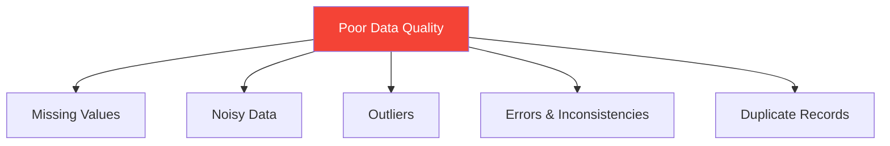

### 1. Missing Values

**Example Dataset:**

| Age | Income | Purchased |
|-----|--------|-----------|
| 25  | 50000  | Yes       |
| 30  | ?      | Yes       |
| ?   | 60000  | No        |
| 35  | 70000  | ?         |

**Impact:** Model cannot learn complete patterns

**Solutions:**
- Remove rows with missing data
- Impute (fill) missing values with mean/median/mode
- Use algorithms that handle missing data

### 2. Noisy Data

**Definition:** Random errors or meaningless data points

**Example:** Temperature sensor recording 500°C in a living room (sensor malfunction)

**Impact:** Model learns incorrect patterns

### 3. Outliers

**Definition:** Extreme values that don't represent normal patterns

**Example:** House prices dataset

| Square Feet | Price |
|-------------|-------|
| 1500        | $300K |
| 2000        | $400K |
| 1800        | $350K |
| 1600        | $50M  | ← Outlier (likely error)

**Impact:** Skews the model's learning

### 4. Errors & Inconsistencies

**Example:**
- Gender field: "M", "Male", "male", "m" (inconsistent)
- Dates in different formats: "01/12/2024" vs "12-01-2024"
- Typos: "Caht" instead of "Cat"

### 5. Duplicate Records

**Impact:** Model gives extra weight to duplicated examples

**Example:**
- Same customer data entered twice
- Training set contaminated with test set data

### Data Quality Impact

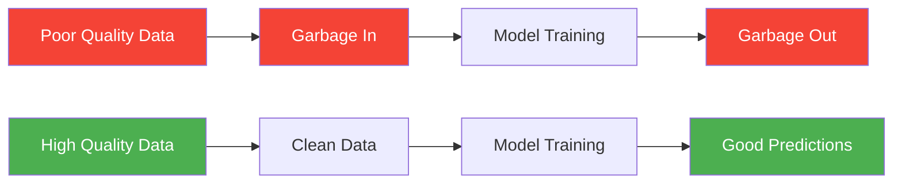

**Remember:** "Garbage in, garbage out" - no amount of sophisticated algorithms can fix bad data.

### Solutions

- **Data Cleaning:** Remove/fix errors
- **Data Validation:** Check for consistency
- **Outlier Detection:** Identify and handle extreme values
- **Deduplication:** Remove duplicate records
- **Imputation:** Fill missing values appropriately

---

## 4. Overfitting

**Problem:** Model learns the training data **too well**, including noise and irrelevant patterns. Performs great on training data but poorly on new data.

**Analogy:** *Like memorizing exam questions and answers instead of understanding concepts - you ace practice tests but fail on new questions.*

### What is Overfitting?

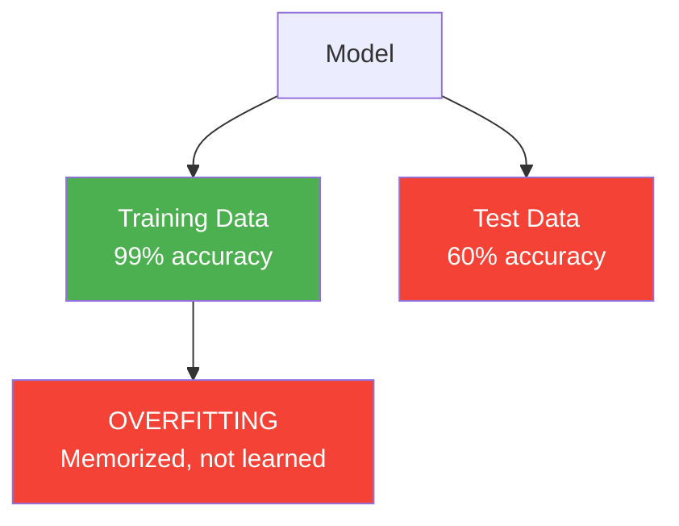

**Characteristics:**
- Very high training accuracy
- Much lower test/validation accuracy
- Model has learned noise and outliers
- Poor generalization to new data

### Visual Example

**Imagine fitting a curve to data points:**

**Underfitting** (too simple):
```
Simple line missing the pattern
```

**Good Fit** (just right):
```
Smooth curve capturing the trend
```

**Overfitting** (too complex):
```
Wiggly line passing through every point, including noise
```

### Causes of Overfitting

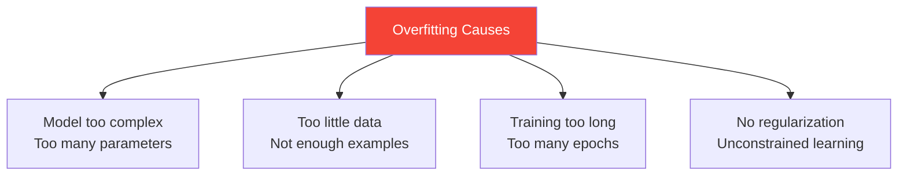

### Example: Polynomial Regression

**Dataset:** House prices vs square footage

| Model Complexity | Training Accuracy | Test Accuracy | Status |
|-----------------|-------------------|---------------|--------|
| Linear (degree 1) | 75% | 74% | Underfitting |
| Quadratic (degree 2) | 85% | 84% | Good fit |
| Polynomial (degree 20) | 99% | 55% | **Overfitting** |

### Solutions to Overfitting

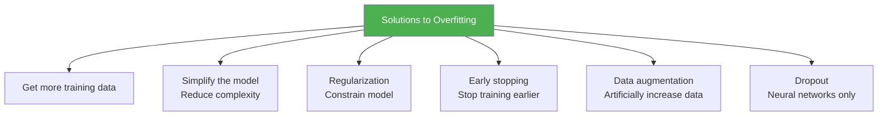

**Key Solutions:**
1. **More data:** Harder to memorize, forces generalization
2. **Simpler model:** Fewer parameters to overfit
3. **Regularization:** Penalize complexity (L1, L2)
4. **Cross-validation:** Better evaluation
5. **Early stopping:** Stop before memorization begins

---

## 5. Underfitting

**Problem:** Model is **too simple** to capture underlying patterns in the data. Performs poorly on both training and test data.

**Analogy:** *Like trying to explain Shakespeare with a 3-word vocabulary - too simple to capture the complexity.*

### What is Underfitting?

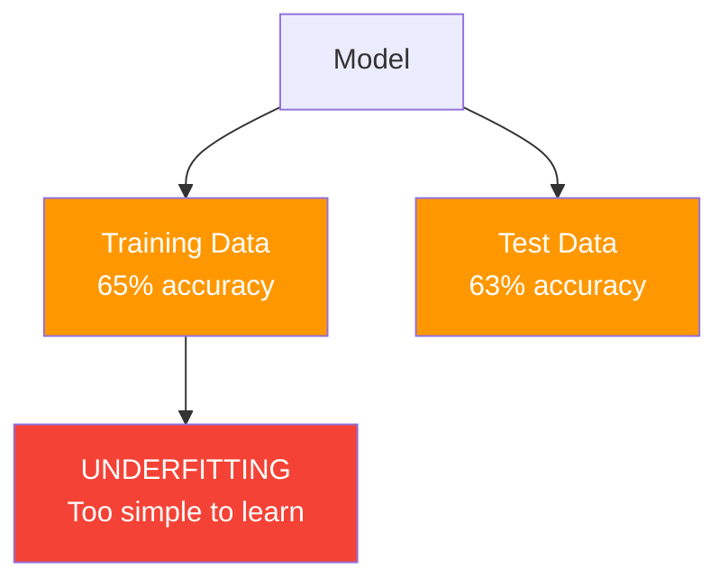

**Characteristics:**
- Low training accuracy
- Low test accuracy (similar to training)
- Model hasn't learned enough from data
- Poor performance everywhere

### Causes of Underfitting

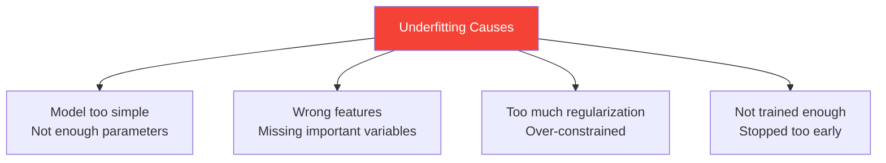

### Example: Image Classification

**Task:** Classify images of cats vs dogs

| Model Choice | Training Accuracy | Test Accuracy | Status |
|-------------|-------------------|---------------|--------|
| Logistic Regression | 60% | 59% | **Underfitting** |
| Simple Neural Network | 85% | 83% | Good fit |
| Deep CNN | 98% | 97% | Excellent |

**Why?** Logistic regression too simple for complex image patterns.

### Solutions to Underfitting

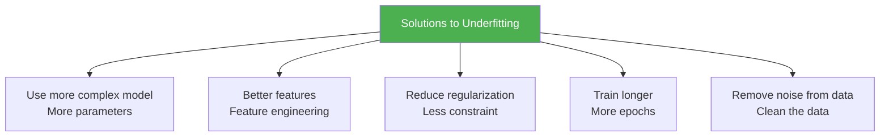

**Key Solutions:**
1. **More complex model:** Increase capacity
2. **Better features:** Add relevant information
3. **Reduce regularization:** Allow more flexibility
4. **Train longer:** Give model more time to learn
5. **Ensemble methods:** Combine multiple models

---

## The Bias-Variance Tradeoff

**The relationship between underfitting and overfitting:**

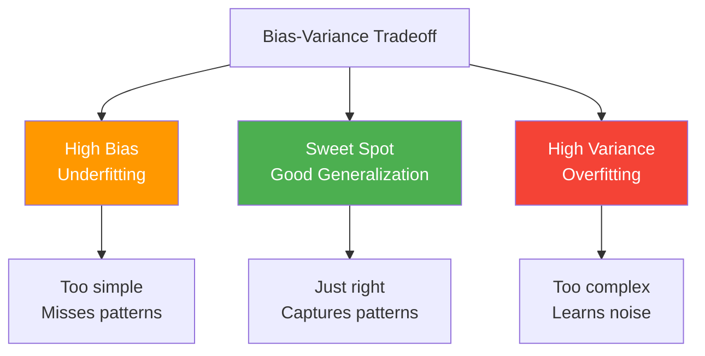

### Visual Comparison

| Aspect | Underfitting | Good Fit | Overfitting |
|--------|-------------|----------|-------------|
| **Model Complexity** | Too simple | Just right | Too complex |
| **Training Accuracy** | Low (~65%) | High (~85%) | Very high (~99%) |
| **Test Accuracy** | Low (~63%) | High (~84%) | Low (~60%) |
| **Bias** | High | Balanced | Low |
| **Variance** | Low | Balanced | High |
| **Problem** | Doesn't learn patterns | - | Learns noise |
| **Solution** | More complex model | Keep it | Simplify or more data |

---

## Summary: All Challenges Together

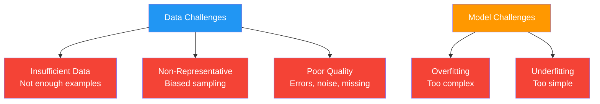

### Quick Reference

| Challenge | Main Issue | Key Solution |
|-----------|-----------|--------------|
| **Insufficient Data** | Not enough examples | Collect more data or use simpler model |
| **Non-Representative** | Biased/limited data | Diverse, balanced data collection |
| **Poor Quality** | Errors, noise, missing values | Data cleaning and validation |
| **Overfitting** | Model too complex, learns noise | More data, simpler model, regularization |
| **Underfitting** | Model too simple, misses patterns | More complex model, better features |

---

## Related Notes

- [[0. Machine Learning Terms]]
- [[1. Types of Machine Learning]]
---

#machine-learning #challenges #overfitting #underfitting #data-quality