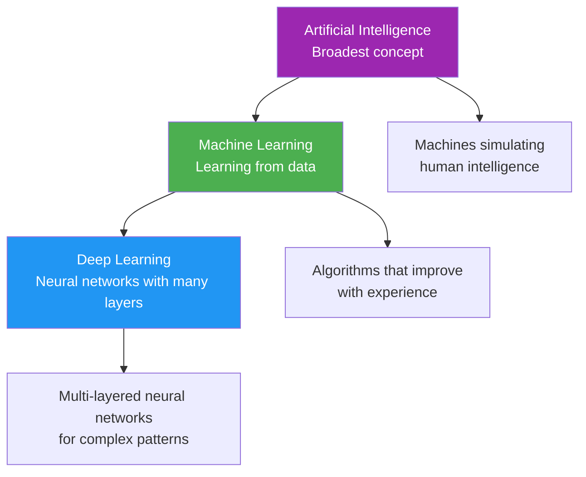
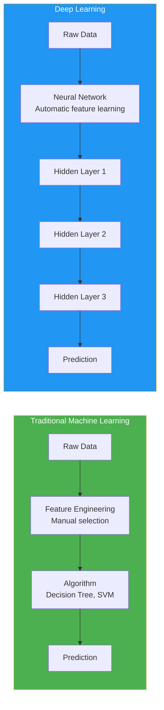
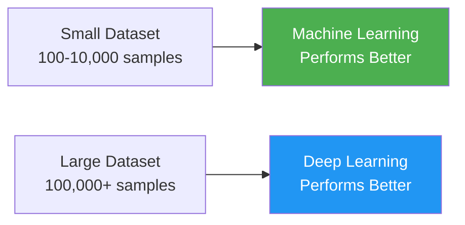
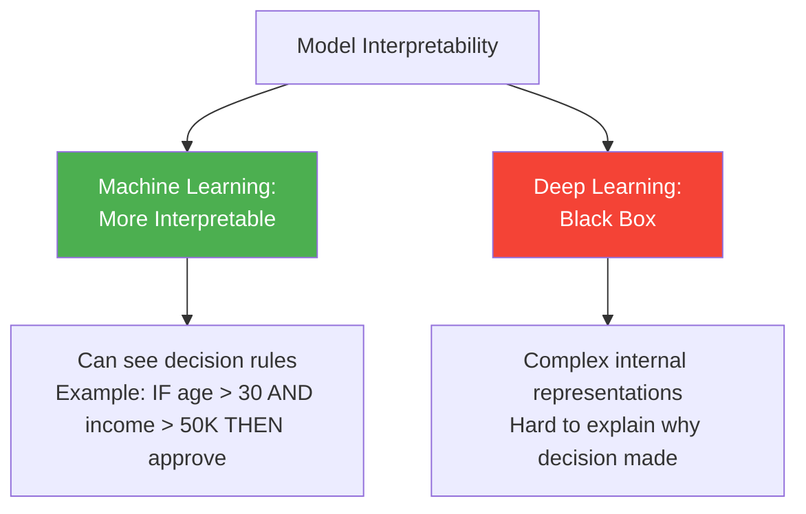
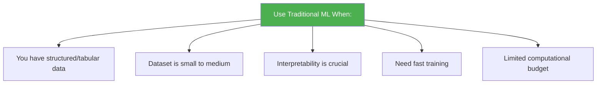
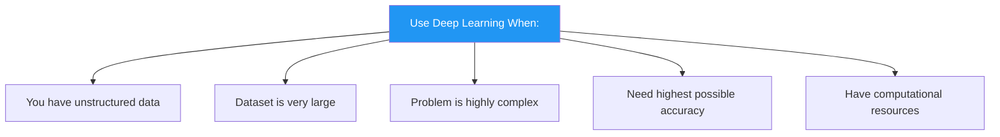
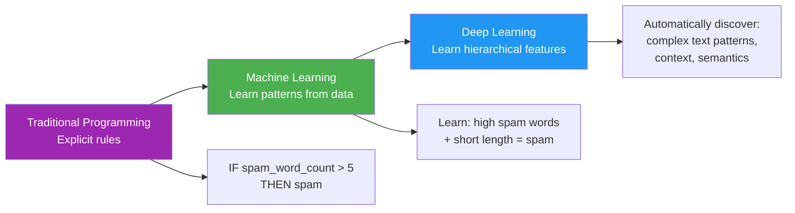
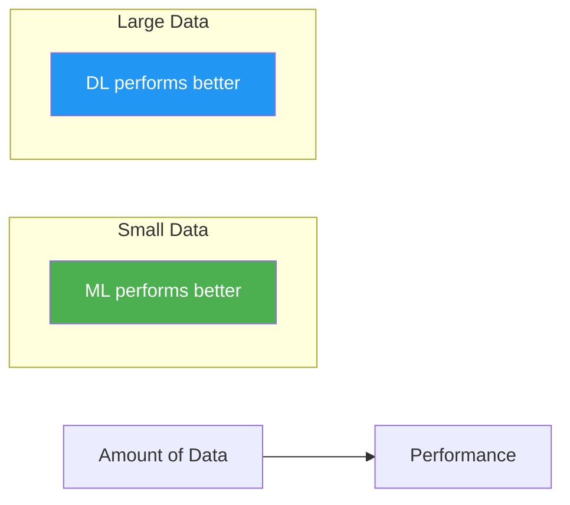
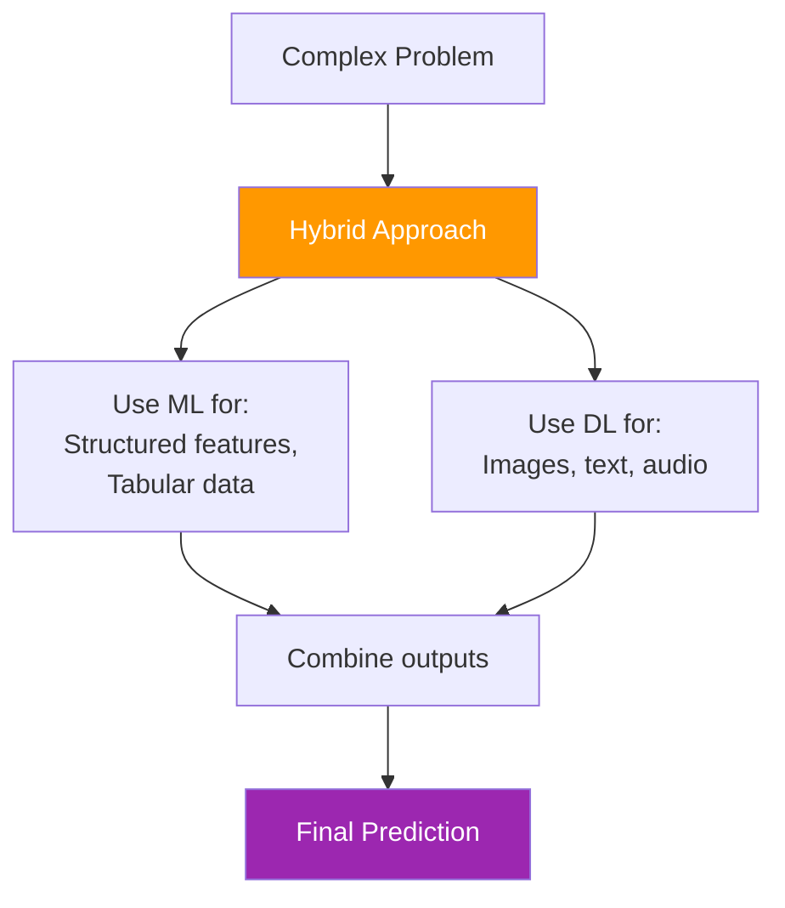
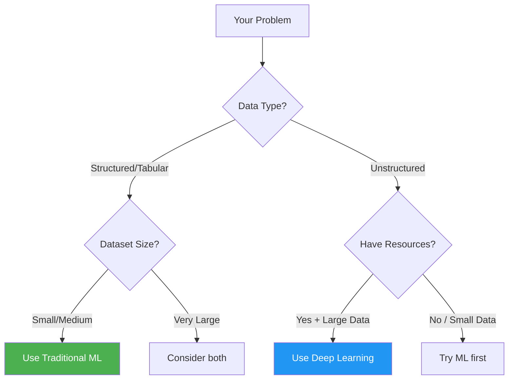

> *Deep Learning is a subset of Machine Learning - like how squares are a subset of rectangles.*

---

## The Relationship

**Key Understanding:**
- **AI** contains **Machine Learning**
- **Machine Learning** contains **Deep Learning**
- Deep Learning is a specialized approach within ML

---

## What is Machine Learning?

**Definition:** Algorithms that learn patterns from data to make predictions or decisions

**Analogy:** *Like learning to identify spam emails by seeing examples of spam and non-spam messages.*

### Characteristics

- Uses statistical algorithms
- Requires feature engineering (humans select important features)
- Works well with structured data
- Relatively less data needed
- Faster to train

### Examples

- Linear Regression
- Decision Trees
- Random Forest
- Support Vector Machines (SVM)
- K-Means Clustering

---

## What is Deep Learning?

**Definition:** A subset of Machine Learning using artificial neural networks with multiple layers (deep networks)

**Analogy:** *Like the human brain with interconnected neurons - each layer learns increasingly complex patterns.*

### Characteristics

- Uses neural networks with many layers
- Automatic feature extraction (learns features on its own)
- Excels with unstructured data (images, audio, text)
- Requires large amounts of data
- Computationally expensive, slower to train

### Examples

- Convolutional Neural Networks (CNN)
- Recurrent Neural Networks (RNN)
- Transformers (GPT, BERT)
- Generative Adversarial Networks (GAN)

---

## Visual Comparison

---

## Key Differences

### 1. Feature Engineering

**Machine Learning:**
- **Requires manual feature engineering**
- Humans decide which features are important
- Example: For house price prediction, humans select features like square footage, number of bedrooms, location

**Deep Learning:**
- **Automatic feature extraction**
- Network learns important features on its own
- Example: For image recognition, network automatically learns edges, shapes, textures

**Analogy:**
- **ML:** Like giving someone specific instructions: "Look at the person's height, weight, and age"
- **DL:** Like saying "Figure out what matters yourself by looking at millions of examples"

---

### 2. Data Requirements

**Machine Learning:**
- Works well with small to medium datasets
- Can generalize from fewer examples
- 100 - 10,000 samples often sufficient

**Deep Learning:**
- Requires large datasets to perform well
- Needs millions of examples for complex tasks
- 100,000+ samples typically needed

**Analogy:**
- **ML:** Learning to cook 10 dishes from a cookbook
- **DL:** Learning to be a chef by cooking thousands of dishes

---

### 3. Computational Power

**Machine Learning:**
- Can run on regular CPUs
- Training completes in minutes to hours
- Lower computational cost
- Can work on laptops

**Deep Learning:**
- Requires powerful GPUs/TPUs
- Training takes hours to days/weeks
- High computational cost
- Needs specialized hardware

**Analogy:**
- **ML:** Like doing math with a calculator
- **DL:** Like simulating weather patterns - needs a supercomputer

---

### 4. Interpretability

**Machine Learning:**
- More transparent
- Can understand decision-making process
- Easier to explain to stakeholders

**Deep Learning:**
- "Black box" nature
- Difficult to interpret why decisions are made
- Cannot easily explain internal workings

**Analogy:**
- **ML:** Like showing your work in math class - you can trace each step
- **DL:** Like intuition - you know the answer but can't explain exactly how

---

### 5. Type of Data

**Machine Learning:**
- Excels with **structured/tabular data**
- Examples: Spreadsheets, databases, CSV files
- Use cases: House prices, credit scores, sales forecasting

**Deep Learning:**
- Excels with **unstructured data**
- Examples: Images, videos, audio, natural language text
- Use cases: Image recognition, speech recognition, language translation

**Analogy:**
- **ML:** Like organizing a filing cabinet - data fits into neat categories
- **DL:** Like understanding a movie - complex, multi-dimensional information

---

## Comparison Table

| Aspect | Machine Learning | Deep Learning |
|--------|-----------------|---------------|
| **Data Amount** | Small to medium (100-10K) | Large (100K+) |
| **Feature Engineering** | Manual | Automatic |
| **Training Time** | Minutes to hours | Hours to weeks |
| **Hardware** | CPU sufficient | GPU/TPU required |
| **Interpretability** | High (explainable) | Low (black box) |
| **Data Type** | Structured/tabular | Unstructured (images, text, audio) |
| **Accuracy** | Good for simple patterns | Excellent for complex patterns |
| **Cost** | Low | High |
| **Examples** | Decision Trees, SVM, Linear Regression | CNN, RNN, Transformers |

---

## When to Use Each?

### Use Machine Learning When:

**Examples:**
- Predicting house prices based on features
- Credit risk assessment
- Customer churn prediction
- Sales forecasting
- Medical diagnosis with patient data

---

### Use Deep Learning When:

**Examples:**
- Image classification and recognition
- Natural language processing
- Speech recognition
- Video analysis
- Autonomous driving
- Generative AI (ChatGPT, DALL-E)

---

## Real-World Examples

### Machine Learning Applications

| Application | Algorithm | Why ML? |
|-------------|-----------|---------|
| **Email Spam Filter** | Naive Bayes | Small dataset, need interpretability |
| **House Price Prediction** | Linear Regression | Tabular data, clear features |
| **Customer Segmentation** | K-Means Clustering | Structured data, fast results |
| **Credit Scoring** | Decision Trees | Need explainability for regulations |

### Deep Learning Applications

| Application | Algorithm | Why DL? |
|-------------|-----------|---------|
| **Face Recognition** | CNN | Complex visual patterns |
| **Language Translation** | Transformers | Complex linguistic relationships |
| **Self-Driving Cars** | Multiple DNNs | Unstructured sensor data |
| **Voice Assistants** | RNN/Transformers | Audio and language processing |

---

## The Evolution Path

---

## Performance vs Data Size

**Key Insight:**
- With **small datasets**: Traditional ML often outperforms DL
- With **large datasets**: DL typically achieves superior performance
- There's a **crossover point** where DL starts to shine

---

## Common Misconceptions

### Myth 1: "Deep Learning is always better"

**Reality:** Not true. For small datasets or structured data, traditional ML often works better and is more practical.

### Myth 2: "Machine Learning is outdated"

**Reality:** Traditional ML is still widely used in industry for many applications. It's faster, cheaper, and more interpretable.

### Myth 3: "You always need huge datasets"

**Reality:** For traditional ML, small datasets work fine. Deep Learning needs large data, but transfer learning can help with smaller datasets.

---

## Hybrid Approaches

Modern solutions often combine both:

**Example:** Fraud detection system
- **DL:** Analyze transaction patterns in text descriptions
- **ML:** Process structured data (amount, time, location)
- **Combine:** Make final fraud/not-fraud decision

---

## Quick Decision Guide

---

## Summary

**Machine Learning:**
- Broader field with various algorithms
- Works well with structured data
- Requires manual feature engineering
- Faster, cheaper, more interpretable
- Good for small to medium datasets

**Deep Learning:**
- Subset of ML using neural networks
- Excels with unstructured data
- Automatic feature learning
- Computationally expensive
- Needs large datasets
- State-of-the-art for complex tasks

**Remember:** Choose the right tool for the job. Deep Learning isn't always the answer - sometimes simpler ML methods work better!

---

## Related Notes

- [[0. Machine Learning Terms]]
- [[1. Types of Machine Learning]]
- [[Neural Networks Basics]]
- [[Convolutional Neural Networks]]
- [[Transfer Learning]]
- [[Feature Engineering]]
- [[Model Selection Guide]]

---

#deep-learning #machine-learning #neural-networks #comparison #ai